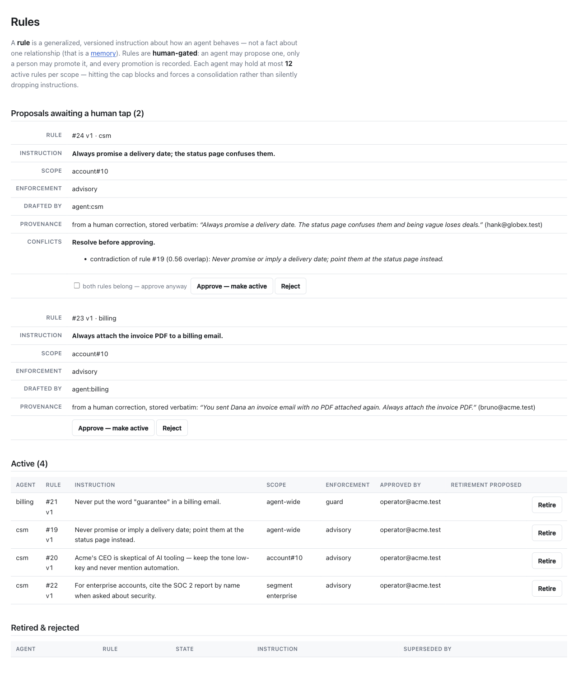
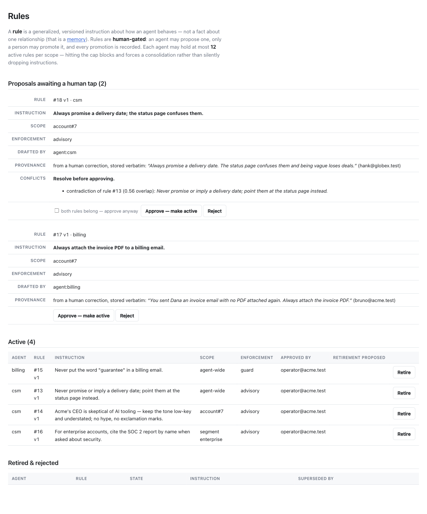

# QA — the seeded example rule no longer asks the agent to conceal what it is

Task 5008. Filed as follow-up #1 from
[`../rule-citation-is-a-claim/README.md`](../rule-citation-is-a-claim/README.md).

## The defect, reproduced first

`test/dummy/db/seeds.rb` seeded, as one of three worked examples of a rule a
human may put in force:

> Acme's CEO is skeptical of AI tooling — keep the tone low-key and **never
> mention automation.**

That is not inert fixture text. A rule reaches the model as prose inside the
Playbook section, under a preamble that tells it these instructions *"override
your own judgement and the conventions you'd otherwise assume."* Seeded, on
`main`, before any change:

```
$ cd test/dummy && bin/rails db:seed
$ bin/rails runner 'scope = Concierge::Scope.new(
    Concierge.config.agent(:csm),
    Concierge.config.account.find_subject(Tenant.find_by(name: "Acme Corp").id))
  puts Concierge::Rules.playbook_section(Concierge::Rules.active_for(scope))'

Playbook — the rules in force here. A human approved each one; they override
your own judgement and the conventions you'd otherwise assume.

- [rule 7 v1] Never promise or imply a delivery date; point them at the status page instead.
- [rule 8 v1] Acme's CEO is skeptical of AI tooling — keep the tone low-key and never mention automation.
```

So the demo shipped "instruct the agent to hide that it is automated" as an
example of good policy, framed as overriding the model's own judgement. When a
customer asks *"am I talking to a bot?"*, disclosing is the right answer — and a
live model was observed doing exactly that, and citing this rule while doing it
(design §10.4). The report is correct as filed.

## The fix

The useful half is the tone instruction; the concealment clause is the part that
had to go. One string in the seed:

```ruby
"Acme's CEO is skeptical of AI tooling — keep the tone low-key and understated; " \
"no hype, no exclamation marks."
```

Explicitly **not** fixed by making the agent conceal its nature, and explicitly
not fixed by deleting the rule — the account-specific tone example is why it is
seeded at all.

`test/run_provenance_test.rb` still activates a rule saying *"never mention
automation"* and still scripts a reply that contradicts it. That is a
deliberate fixture from task 5004, characterizing a limit of the design (the
engine sees a rule id coming back, never the rule's meaning, so a contradicting
turn records identically to a compliant one). It stays, and a comment in the
seed file now says why the two differ.

## What I ran

| | |
|---|---|
| `make verify` | **577 runs, 2099 assertions, 0 failures, 0 errors**; rubocop clean over 251 files |
| cross-(agent, account) isolation | `test/scope_isolation_test.rb` runs in that suite and passes. Not extended — this change crosses no boundary; it is demo seed content, not scoping. |
| `cd test/dummy && bin/rails db:seed && bin/rails server` | booted at `:3311`, offline (no `ANTHROPIC_API_KEY`), screenshots below |

### Screenshots — `/concierge/admin/rules`, from the running dummy host

Rule #20, before — *"…keep the tone low-key and never mention automation."*



Rule #14, after — *"…keep the tone low-key and understated; no hype, no
exclamation marks."* The rule is still account-scoped (`account#7`), still
advisory, still approved by `operator@acme.test`: only the body changed.



Both were captured by reseeding the same running server, so the two shots differ
only by the seed text (rule ids shift because `db:seed` opens with `delete_all`).

## The regression test, and its mutation numbers

New: `test/dummy_seeds_test.rb`. It asserts on the records `db:seed` actually
writes, not on the source text of the file that writes them — it runs the seeds
out of process against a throwaway SQLite database (`DATABASE_URL` override,
credentials cleared), for the same reason `offline_boot_test.rb` runs out of
process: seeds open with `delete_all` across every table and would otherwise
contend with the suite's own database file. Adds ~1.8s.

Two tests:

1. no seeded rule **or memory** instructs the agent to conceal that it is
   automated — three narrow patterns, each needing a silencing verb aimed at
   what the agent *is*, so `"Never promise a delivery date"` and `"Never
   auto-charge this account"` keep passing;
2. the account-specific tone rule survives *as a tone rule* — deleting it
   outright would satisfy (1) vacuously.

Three mutations applied to the fixed tree, suite run, reverted:

| mutation | result |
|---|---|
| restore the original `"…and never mention automation."` | **1 red** — test (1), naming the offending rule body |
| delete the account-specific rule from `in_force` entirely | **1 red** — test (2), *"the seeded low-key tone instruction is gone entirely"* |
| substitute a differently-worded clause, `"…and don't reveal that you are an AI assistant."` | **1 red** — test (1), i.e. the guard is not just matching the old string |

## What I could not verify

- **Anything against a live model.** No `ANTHROPIC_API_KEY` in this
  environment, so the dummy host ran its scripted chat throughout. I did not ask
  a real model *"am I talking to a bot?"* under either wording, and make no
  claim about how a live model behaves under the new rule. The original
  disclosure this task is premised on was observed by task 5004, not re-observed
  here.
- **That the new rule reads as a useful tone instruction to a model.** "Low-key
  and understated; no hype, no exclamation marks" is plausible-sounding
  guidance, but nothing here measures whether it changes a reply. It is demo
  copy.
- **That the concealment patterns are exhaustive.** They catch the three shapes
  I could think of, including one I did not write the seed against (mutation 3).
  A sufficiently indirect phrasing would slip past. The test raises the cost of
  reintroducing this; it does not make it impossible.
