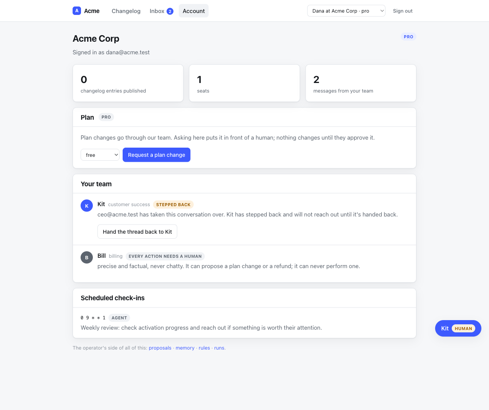
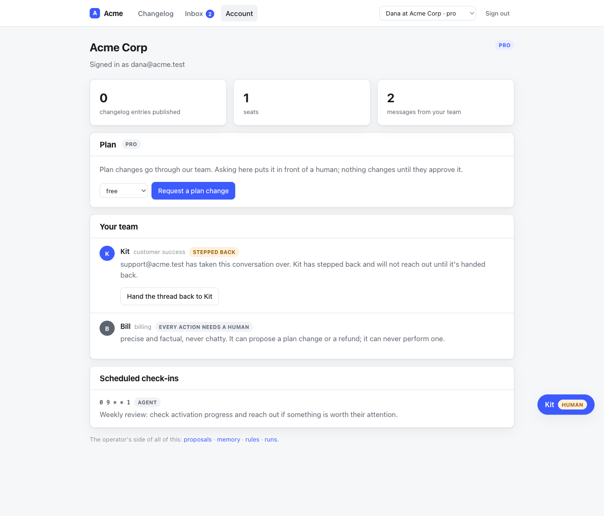

# QA — who is speaking for you is not the caller's to say (task 5011)

Follow-up to task 5005, which filed this under "What I could not verify".

Everything below was done against a genuinely running dummy host
(`cd test/dummy && bin/rails db:prepare && bin/rails db:seed && bin/rails server -p 3211`)
with `ANTHROPIC_API_KEY` **unset** — see "What I could not verify".

> Two notes on the mechanics, because both cost me a wrong number first:
>
> - **:3111 was already held** by a stale server from another worktree, which
>   answered my first requests with *its* app. Everything here is :3211,
>   confirmed by `lsof -nP -iTCP:3211 -sTCP:LISTEN`.
> - **The engine's endpoints are CSRF-protected**, and Rails issues *per-form*
>   authenticity tokens. The token scraped out of a `form_with` is only good for
>   that form's action; the one in `<meta name="csrf-token">` is the one to send
>   as `X-CSRF-Token`. With the form's token every request below is a `422` and
>   the bug looks fixed. It is not.
>
> Seeded ids move on every `db:seed`. **Acme Corp was tenant 4** for the
> reproduction and **tenant 7** after the re-seed that followed the fix; the
> commands below say which.

## The reproduction, first

Signed in through the **Support** door — staff, so `config.authorize_operator`
says yes, exactly as task 5005 intended. Against `origin/main`:

```
$ curl -c $J -b $J -X POST -d "operator=1" -H "X-CSRF-Token: $T" .../signin
signin POST(staff) 302

$ curl -c $J -b $J -X POST -d "operator=ceo@acme.test" \
       -H "X-CSRF-Token: $T" .../concierge/accounts/4/handoff
handoff POST -> 201

$ bin/rails runner 'puts Concierge::Handoff.order(:id).last.attributes.slice(...)'
{"agent_slug"=>"csm", "subject_type"=>"account", "subject_id"=>"4",
 "operator"=>"ceo@acme.test", "state"=>"active"}
```

Support seized Dana's CSM thread and the engine recorded the CEO as the operator
of record. Signing in as Dana and opening `/account`:



> ceo@acme.test has taken this conversation over. Kit has stepped back and will
> not reach out until it's handed back.

That string is the product's, not a log line: `concierge_handoffs.operator` is
rendered to the customer on `/account` and in the chat widget, and provenance
reads the same column. It was caller-supplied text.

The gate was never the problem — the scope is still checked, and this is not a
cross-account hole. The problem is that passing the gate answered *may you* and
the request was left to answer *who are you*.

## The fix

`config.operator_actor` — callable(controller, scope) -> the identity — is a
sibling of `config.authorize_operator` with the same fail-closed default. The
engine no longer reads `params[:operator]` anywhere. Four guards, each of which a
mutation run proves is load-bearing (below):

1. `HandoffsController#create` records `operator`, the host's answer.
2. `HandoffsController#message` passes the same identity as `author:`, so a rule
   drafted from an operator's correction carries who made it — as
   `Slack::Intake` already did and the HTTP path did not.
3. `ScopedEndpoint#require_operator_identity!` refuses **every** operator
   endpoint when the hook is unset or answers blank, with the same `403` and body
   as an unauthorized request (a distinct status would tell an outsider they had
   passed the staff gate).
4. `Handoff` validates `operator` presence, so a host calling `seize!` itself
   cannot record an anonymous takeover either.

A host whose one console genuinely drives several operators can still let the
request name them — in their own hook, after establishing the console may. That
example is in the README and in the install template, and there is a test for it.

## After the fix

Same request, same staff session, re-seeded app (Acme is tenant 7):

```
$ curl ... -X POST -d "operator=ceo@acme.test" .../concierge/accounts/7/handoff
POST handoff -> 201

$ bin/rails runner '...'
recorded operator: "support@acme.test" (scope csm/7)
```

The parameter is accepted by the router and ignored by the engine. Dana's
`/account`:



> support@acme.test has taken this conversation over.

## What I ran

- `make verify` — rubocop (255 files, no offenses) + `bin/test`:
  **608 runs, 2239 assertions, 0 failures, 0 errors, 0 skips.**
- The cross-(agent, account) isolation suites specifically —
  `test/scope_isolation_test.rb` and `test/integration/host_isolation_test.rb`:
  green, and the second is where the new boundary tests live rather than beside
  it. The boundary here is the third one on this seam: not account-to-account,
  not customer-to-staff, but **one staff identity and another** — a crossing that
  happens *inside* the gate, so neither existing hook could see it.
- The reproduction and the verification above, by hand, on a running server.

### The mutation run

Revert the fix in full — `params[:operator]` back in both actions, the
`before_action` gone, the validation gone — and re-run the suite:

**12 tests go red.**

```
Concierge::HandoffTest#test_a_takeover_with_nobody's_name_on_it_is_refused
HandoffFlowTest#test_an_operator_can_seize,_send_as_human,_and_release_a_thread_over_HTTP
HostIsolationTest#test_an_operator_cannot_seize_a_thread_as_somebody_else
HostIsolationTest#test_an_operator_cannot_author_another_operator's_correction_either
OperatorAuthorizationTest#test_the_operator_of_record_is_the_host's_answer,_not_the_request's
OperatorAuthorizationTest#test_the_identity_hook_is_handed_the_controller_and_the_resolved_scope
OperatorAuthorizationTest#test_an_authorized_operator_the_host_will_not_name_is_refused,...
OperatorAuthorizationTest#test_a_hook_that_answers_with_nothing_has_not_named_anybody
OperatorAuthorizationTest#test_the_refusal_says_which_hook_is_missing,...
OperatorAuthorizationTest#test_the_refusal_is_indistinguishable_from_an_unauthorized_one
OperatorAuthorizationTest#test_the_named_operator_authors_the_correction_the_takeover_captures
OperatorAuthorizationTest#test_a_host_whose_console_drives_several_operators_can_still_...
```

Then one guard at a time, to show none of the four is carried by the others:

| Mutation | Failures |
|---|---|
| `seize!(operator: params[:operator])` | 6 |
| drop `author: operator` from the capture | 2 |
| remove `before_action :require_operator_identity!` | 5 |
| remove `validates :operator, presence: true` | 1 |
| accept a blank answer (`.to_s` without `.presence`) | 5 |

Reverted; the suite is green again at 608/0.

## What I could not verify

- **A real model.** No `ANTHROPIC_API_KEY` here, so the dummy host runs
  `Dummy::ScriptedChat` over the real assembled prompt. Nothing on this path
  reaches a model — the identity is decided before a turn is ever run, and the
  one rule-drafting assertion goes through the deterministic generalizer, not an
  LLM one — but no live turn was made and I am not implying otherwise.
- **A host with real staff records.** `Operator` in the dummy app is still a
  session key and a constant: one seat, no staff table, no book of accounts. So
  `operator_actor` is exercised as "read the session", which is the shape, but
  never against a host that can distinguish two operators from each other. The
  "one console, several operators" form is covered only by
  `operator_authorization_test.rb`, never by a running console.
- **Existing hosts upgrading.** There are none — the gem is unreleased at 0.1.0,
  which is why this fails closed rather than defaulting to the old parameter. A
  released gem would need a deprecation window; the decision is stated here so it
  can be reversed cheaply.
- **`config.admin_actor` was left alone.** It answers a different surface's
  question (who approved a proposal) and takes only the controller. Merging the
  two was the other option the task offered; I took the sibling because the
  approval queue and an operator console may be two sessions, and a host for
  which they are one writes a one-line hook that says so. If that turns out
  backwards it is one deletion, not a migration.
- **The demo host's own "Talk to a human" button** still names
  `support@acme.test` from a constant in `test/dummy`. That is the *host's* call
  to `Handoff.seize!` — the customer asking for a person, not staff seizing a
  thread — and the host owns that identity. Untouched on purpose; the isolation
  suite still asserts it.
- **`Handoff` has no `released_by`.** Releasing is now gated on a named operator,
  but who released a thread is still not recorded anywhere — and releasing is the
  act that re-enables proactive outbound. Out of scope; filed as ty task **5016**
  rather than widened into here.
