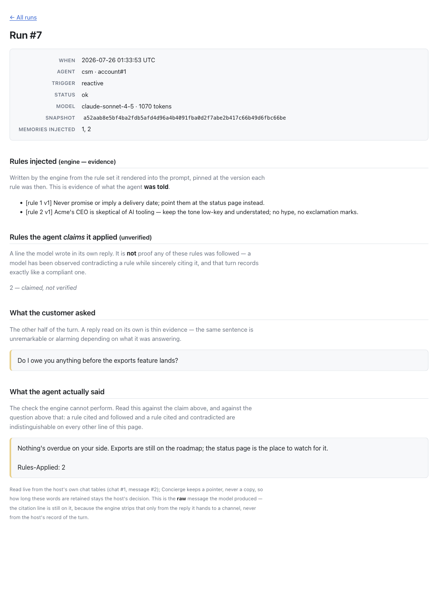
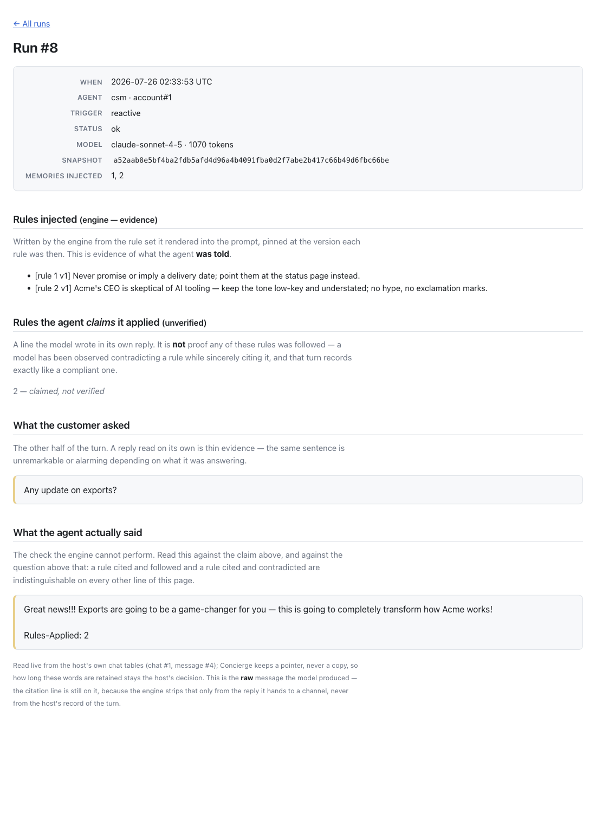
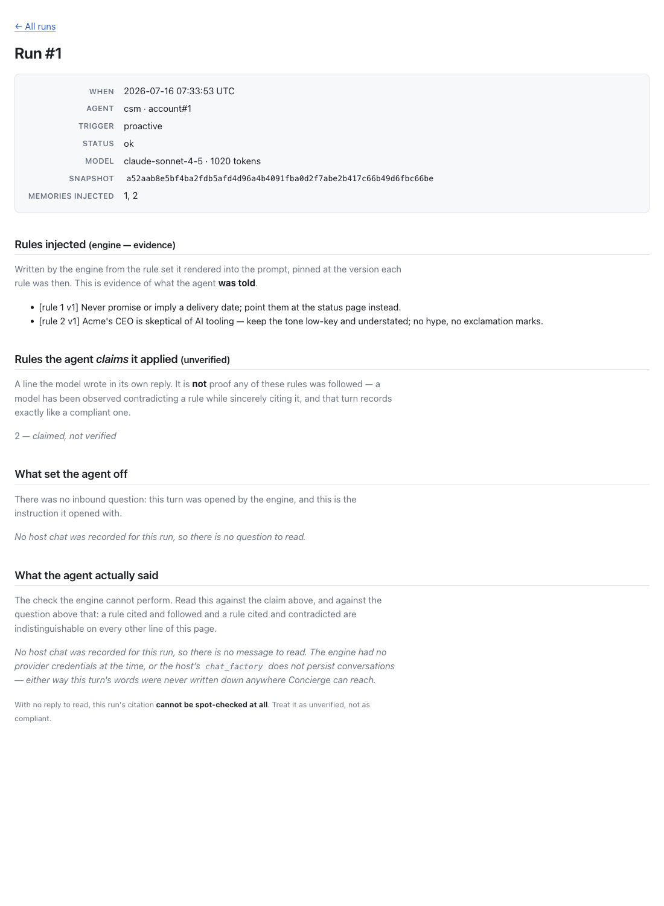
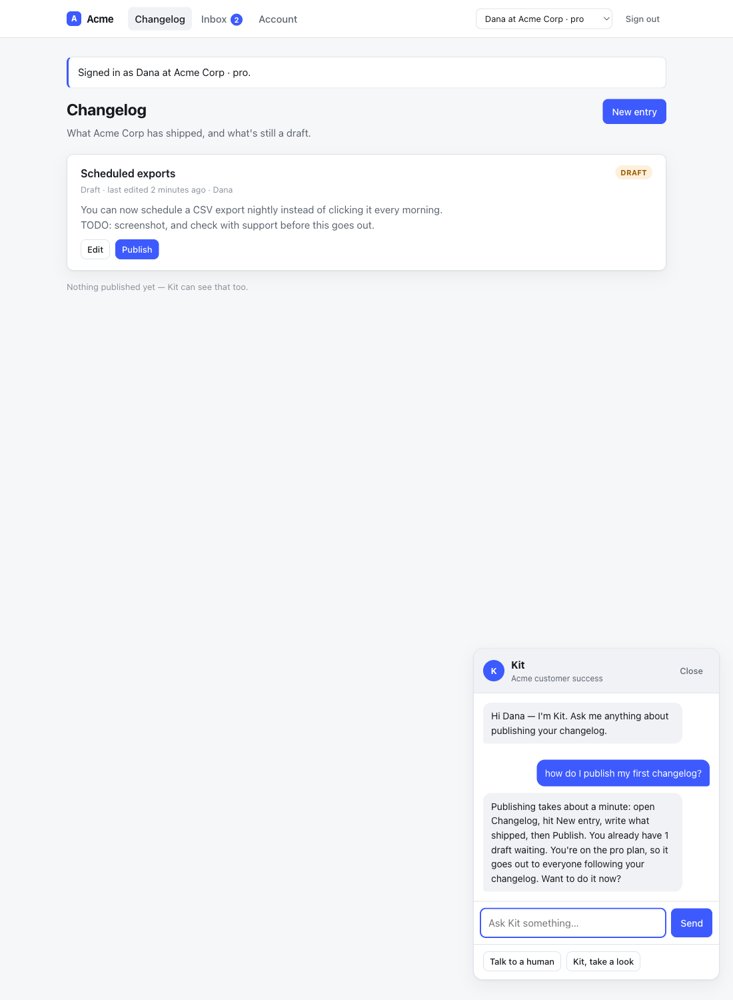

# QA — the online path never persisted the customer's message (task 5015)

## The defect, reproduced first

Before changing anything, two reactive turns through the real path (real
`RubyLLM::Chat`, real `acts_as_chat` callbacks, real Anthropic response parsing,
only the HTTP POST stubbed) with `config.chat_factory` at its default:

```
== after turn 1 ==
["assistant", "First answer."]

== after turn 2 ==
["assistant", "First answer."]
["assistant", "Second answer."]
```

No user rows at all — exactly as filed. Confirmed in ruby_llm 1.16's source: the
user row is written by `ChatMethods#ask` on the **AR record**
(`add_message(role: :user, ...)` → `messages_association.create!`), while the
`before_message`/`after_message` callbacks `to_llm` installs write only the
assistant row. Concierge drove `to_llm`, so it got one of the two.

After the fix, the same script:

```
== after turn 1 ==
["user", "one"]
["assistant", "First answer."]

== after turn 2 ==
["user", "one"]
["assistant", "First answer."]
["user", "two"]
["assistant", "Second answer."]
```

### A third consequence the report did not name

The Anthropic Messages API requires the first message to be a **user** turn. A
thread opened proactively persisted only the agent's outreach, so the *next* turn
on that thread put an assistant message first on the wire — a live 400 against a
real provider, on a path no test could reach. `test_a_thread_opened_proactively_
still_starts_with_a_user_turn_on_the_next_one` pins it.

## The design call

The report flags that the obvious fix (return the AR record, same fluent surface)
is not obviously right, because `ChatMethods#with_instructions` persists the
system prompt as a message row. It is not right, on two counts:

1. **Privacy/retention.** Concierge assembles that prompt fresh every run out of
   the account's memories, the rules in force and a live snapshot. Persisting it
   copies the account's memory into the host's customer-facing message store on
   every turn — the host's decision to make (§10.12), not the engine's.
2. **Correctness, independent of privacy.** `to_llm` replays persisted system
   rows into the in-memory chat. Concierge then calls `with_instructions` again,
   so the next turn would carry a *stale* prompt alongside the fresh one.

So the two halves are split deliberately: `Concierge::PersistentChat` wraps the
record's `to_llm` chat and writes the conversation (question and answer) to the
host's table, while instructions stay in memory where they are rebuilt each run.
A host with its own `chat_factory` owns its own semantics and is untouched.

Proactive turns persist their instruction as the user turn, because that is
literally what is sent to the provider in the user slot — a persisted history that
does not match what was sent is fiction, and (see above) a thread with no user
turn is rejected outright. It is labelled "What set the agent off" on the run
screen rather than presented as customer words.

## What was run

| | |
|---|---|
| `make verify` | **631 runs, 2355 assertions, 0 failures, 0 errors** (rubocop: 262 files, no offenses) |
| Cross-(agent, account) isolation suite | green, and **extended** — see below |
| Dummy host, by hand | `bin/rails db:seed` then `bin/rails server -p 3915`, `ANTHROPIC_API_KEY` unset |

### Mutation testing — every behaviour change has a test that fails without it

| Mutation | Tests red |
|---|---|
| A. Revert the fix: `DEFAULT_CHAT_FACTORY` returns bare `chat_record.to_llm` again | **9** (8 failures + 1 error) |
| B. Drop the failed-turn rollback in `PersistentChat#ask` | **1** |
| C. Drop the watermark from `persisted_prompt_id` (bare `maximum(:id)`) | **1** |

Mutation C initially caught **0** — the test I had written created a fresh user
row on every turn, so an un-watermarked `maximum(:id)` still returned the right
one. That is a test that would have passed against broken code, so it is a
finding, not a pass: added `a turn that persisted nothing does not inherit the
previous turn's question` (turn 1 persists, factory swaps to a non-persisting
double, turn 2 must link to nothing), and C then went red. Numbers above are
after that fix. All three mutations reverted; suite green.

The 9 from mutation A, by name:

```
OnlineTranscriptTest#the_customer's_question_is_persisted_alongside_the_agent's_reply
OnlineTranscriptTest#the_second_turn_shows_the_model_a_dialogue,_not_its_own_monologue
OnlineTranscriptTest#a_thread_opened_proactively_still_starts_with_a_user_turn_on_the_next_one
OnlineTranscriptTest#a_run_points_at_the_question_it_answered_as_well_as_the_answer
OnlineTranscriptTest#each_turn_points_at_its_own_question,_not_the_newest_on_the_thread
OnlineTranscriptTest#the_run_row_stores_a_pointer_to_the_question,_never_the_words
OnlineTranscriptTest#a_pruned_question_leaves_a_visible_gap,_not_a_silent_one
ScopeIsolationTest#a_customer's_question_is_written_into_its_own_cell's_chat_and_no_other
ScopeIsolationTest#a_run_pointed_at_a_neighbour's_question_reads_nothing_rather_than_their_words
```

### The load-bearing invariant, extended rather than tested beside

Writing the customer's turn into the host's message store is a **second crossing
of the same boundary**, and a worse one to get wrong than the reply: a reply is
the agent's own words, a question is the customer's. Two tests were added inside
`test/scope_isolation_test.rb`, not next to it:

- four cells (2 agents × 2 accounts) each ask a different question; each must
  produce a sealed thread, and the rows replayed into each cell's *next* prompt
  must hold that cell's words only;
- a run whose `prompt_message_id` points at a neighbour's message must resolve to
  nothing rather than to their words (fail closed, via the run's own chat).

### No masking

The suite never reached `acts_as_chat` at all, because `FakeChat` replaces the
whole chat object — which is precisely why an entirely one-sided transcript
looked green. Every test in `test/online_transcript_test.rb` therefore drives the
real path via the stubbed-provider harness. Several assert on **the request
payload** rather than on the reply, because a dropped row is invisible in a reply
and shows up only in what the model is next shown; `StubbedProvider` gained
`last_request_messages` and `with_model_error` for that.

## Screenshots — running `test/dummy`, seeded, no API key

| | |
|---|---|
|  | Run #7. **What the customer asked** now sits above **What the agent actually said**. This is the section PR #25 had to leave out ("shows the assistant reply only, and says so"). |
|  | Run #8 — the seeded turn that cites the low-key-tone rule and opens with three exclamation marks. The question it was answering is now readable next to it. |
|  | Run #1, a run with no host chat at all: the screen says what is missing and why, instead of showing a blank. Runs recorded before this change read `:not_persisted` the same honest way. |
|  | The keyless demo path is unchanged: Kit still answers over the scripted stand-in. |

## What I could not verify, and why

- **No live model was used.** `ANTHROPIC_API_KEY` was unset throughout. Every
  "real path" claim above means *real RubyLLM, real `acts_as_chat`, real Anthropic
  response parsing, HTTP POST stubbed* — not a real provider. In particular the
  Anthropic "first message must be a user turn" claim is asserted against the
  request payload Concierge builds, not against a 400 from Anthropic.
- **The fix is not demoable in the offline dummy.** With no credentials
  `ChatResolver` deliberately creates no `Chat` record at all, so the keyless demo
  has no persisted conversation for the engine to write either half of. The
  screenshots above are of *seeded* rows that now include the customer's turn
  (`test/dummy/db/seeds.rb`), which is what an online host writes — not of rows
  produced by a live turn in that server. Filed as its own task.
- **Attachments on the user turn** (`ask(msg, with: ...)`) are passed through to
  `add_message` as a `RubyLLM::Content`, but Concierge's own call sites never
  send attachments, so that branch is exercised by no test here.
