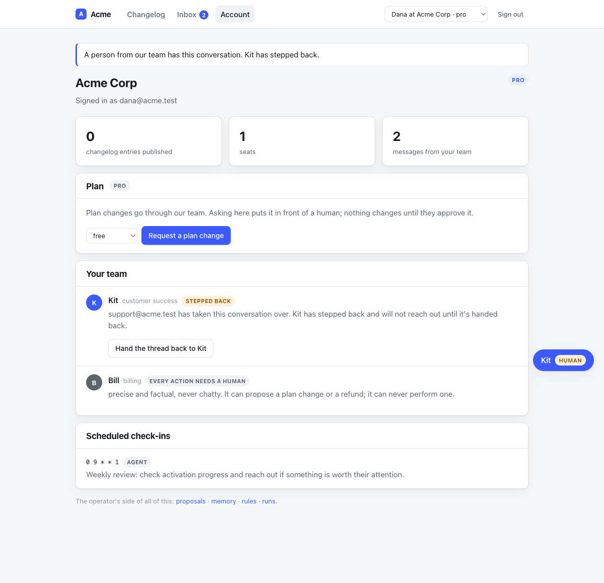
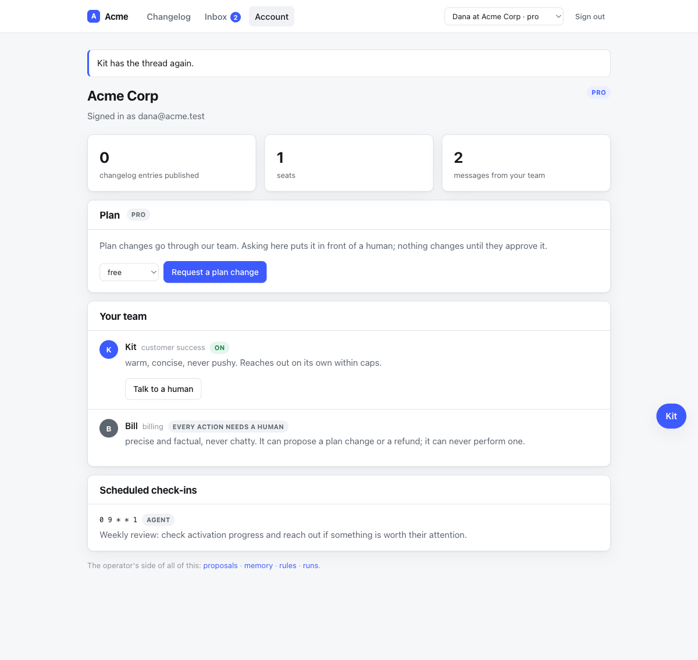
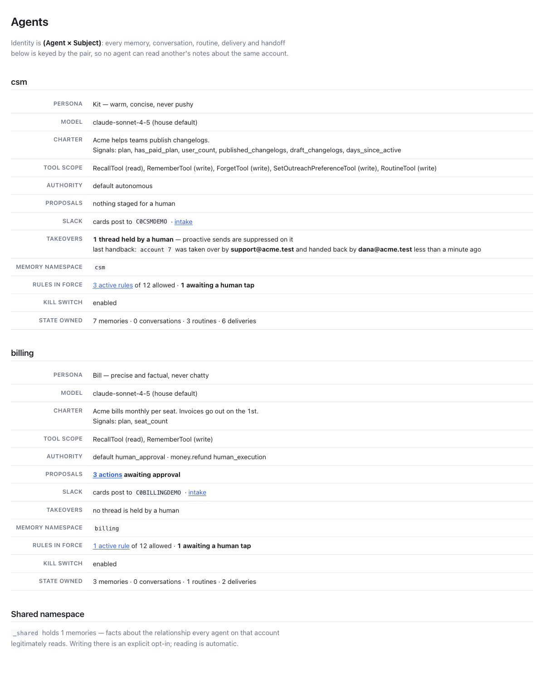

# QA — a released thread now records who gave it back (task 5016)

Filed out of task 5011, which made the *operator of record* the host's answer and
left the other end of the takeover recording only a timestamp.

Everything below was done against a genuinely running dummy host
(`cd test/dummy && bin/rails db:prepare && bin/rails db:seed && bin/rails server -p 3216`)
with `ANTHROPIC_API_KEY` **unset** — see "What I could not verify". Port 3216
confirmed mine with `lsof -nP -iTCP:3216 -sTCP:LISTEN`. Seeded ids move on every
`db:seed`; **Acme Corp was tenant 7** throughout.

## The reproduction, first

Against `origin/main`, in the dummy host:

```
$ bin/rails runner '
  scope = Concierge::Scope.new(Concierge.config.agent(:csm),
            Concierge.config.account.find_subject(Tenant.find_by(name: "Acme Corp").id))
  Concierge::Handoff.seize!(scope, operator: "support@acme.test").release!
  puts Concierge::Handoff.order(:id).last.attributes.slice(
    "operator","state","seized_at","released_at").inspect
  puts "columns: " + Concierge::Handoff.column_names.inspect'

{"operator"=>"support@acme.test", "state"=>"released",
 "seized_at"=>2026-07-26 08:08:42 UTC, "released_at"=>2026-07-26 08:08:42 UTC}
columns: ["id", "agent_slug", "created_at", "operator", "released_at",
          "seized_at", "state", "subject_id", "subject_type", "updated_at"]
```

Who took the thread over is durable and attributable. Who handed the account back
to an autonomous agent is not recorded at all — and `release!` took no argument,
so no caller could have recorded it if it wanted to. The asymmetry matters
because releasing is the act that *re-enables* proactive outbound for that
(agent, subject); `Concierge::Run` suppresses proactive runs only while a handoff
is active.

## The fix

- `concierge_handoffs.released_by`, written by `release!(by:)`.
- `by:` is **required**, and `released_by` is validated present on a released row
  — the same fail-closed shape `seize!(operator:)` has. This is a model-API
  change, so every host calling `release!` answers too; the dummy host's "Hand
  the thread back to Kit" button now does.
- The engine's `DELETE /concierge/accounts/:subject_id/handoff` takes the name
  from `config.operator_actor` (`ScopedEndpoint#operator`), never from the
  request.

### The three questions in the ticket, answered

1. **Does `release!` grow a required `by:`?** Yes. A handback nobody is named for
   is an audit trail with a hole in it, and a host that cannot say who is acting
   should hear about it at the call site rather than have the engine record an
   anonymous row. `ArgumentError` at the call, `RecordInvalid` on a blank name.
2. **Does the customer-facing surface say it?** No. `/account` says
   *"&lt;operator&gt; has taken this conversation over"* because that line answers
   "who is speaking for the company right now" — after a handback nobody is, and
   the card already returns to *Kit · on*. The audience for the handback is
   staff, so it surfaces on `/concierge/admin/agents` instead (screenshot below).
3. **A trail, or two more columns?** Two columns — the trail already exists.
   `seize!` reuses only a handoff that is *still active*, so every seize/release
   cycle is its own row and no cycle overwrites the one before it. A regression
   test asserts a thread taken and handed back twice keeps both pairs.

## What I ran

### The host's own button — support took it, Dana gave it back

Signed in as Dana (customer seat) → `/account` → **Talk to a human**:



→ **Hand the thread back to Kit**:



```
$ bin/rails runner 'puts Concierge::Handoff.order(:id).last.attributes.slice(
    "subject_id","operator","state","released_by").inspect'
{"subject_id"=>"7", "operator"=>"support@acme.test", "state"=>"released",
 "released_by"=>"dana@acme.test"}
```

Two different names on one cycle, which is the case the engine could not record
at all before. The dummy's button is on the *customer's* page, so the seat that
ends the takeover really is Dana — a host with a staff console passes that
operator's identity instead.

### The engine endpoint — and the forgery it refuses

Signed in through the **Support** door (staff, so `config.authorize_operator`
says yes), driving the engine's own endpoints with curl. The `X-CSRF-Token` is
the one from `<meta name="csrf-token">`, not a form's:

```
$ curl ... -X POST   .../signin -d "operator=1"                      -> 302
$ curl ... -X POST   .../concierge/accounts/7/handoff                -> 201
$ curl ... -X DELETE .../concierge/accounts/7/handoff \
           -d "operator=ceo@acme.test"                               -> 204

$ bin/rails runner 'puts Concierge::Handoff.order(:id).last.attributes.slice(
    "operator","released_by").inspect'
{"operator"=>"support@acme.test", "released_by"=>"support@acme.test"}
```

The caller named the CEO on the handback and was ignored, exactly as 5011 made
the seizure ignore it.

### The staff surface

`/concierge/admin/agents` grew a **Takeovers** row: how many threads this agent
has lost to a human right now, and both ends of the last handback.



### The consequence the record is about

```
$ bin/rails runner '...Concierge::Run.proactive(scope, instruction: "check in")...'
Acme   (handed back by dana@acme.test):    suppressed=false ok=true
Globex (still held by bruno@acme.test):    suppressed=true  ok=false
```

Handing the thread back is what lets the agent start reaching out to that
customer on its own again. That is why it is worth a name.

### `make verify`

```
645 runs, 2450 assertions, 0 failures, 0 errors, 0 skips
265 files inspected, no offenses detected
```

### Mutation testing — do the new tests actually hold the behaviour?

Each mutation applied to green code, full suite run, then reverted.

| Mutation | Red |
|---|---|
| `release!(by:)` ignores `by:` and the `released_by` validation is deleted (i.e. `origin/main`'s behaviour, keeping the signature) | **8** |
| the endpoint trusts the caller: `release!(by: params[:operator].presence \|\| operator)` | **2** |
| the dummy host assumes the seizer handed back: `release!(by: OPERATOR)` | **1** |

The 8 for the first, by name:

```
Concierge::HandoffTest#test_the_handback_records_who_made_it,_and_it_need_not_be_who_took_it
Concierge::HandoffTest#test_a_handback_with_nobody's_name_on_it_is_refused
Concierge::HandoffTest#test_each_seize/release_cycle_keeps_its_own_pair_of_names
Concierge::ScopeIsolationTest#test_a_handback_ends_one_cell's_takeover_and_attributes_it_to_that_cell_only
HostIsolationTest#test_an_operator_cannot_hand_a_thread_back_as_somebody_else,_or_across_a_boundary
HostHandoffTest#test_closing_the_handoff_gives_the_thread_back,_and_records_who_did
OperatorAuthorizationTest#test_a_hook_that_says_yes_lets_the_whole_takeover_through
OperatorAuthorizationTest#test_who_handed_the_thread_back_is_the_host's_answer_too,_and_need_not_be_who_took_it
```

### The load-bearing invariant

Extended, not tested beside:

- `test/scope_isolation_test.rb` — all four (agent × account) cells seized, one
  released: the released cell is the only one that changed state, and the only
  one carrying the name.
- `test/integration/host_isolation_test.rb` — an operator cannot hand a thread
  back under another operator's name, and doing it on Acme leaves Globex's
  takeover and Acme's billing thread alone.

## What I could not verify

- **No live model.** `ANTHROPIC_API_KEY` was unset for all of the above, so the
  dummy host answered through its scripted offline chat. Nothing here touches
  prompt assembly or the provider, but the online path was not exercised — the
  same gap noted in 5011 and 5015.
- **Rows released before this migration.** `released_by` is nullable and
  deliberately not backfilled: those handbacks were made by somebody the engine
  never asked about. The admin screen renders them as *"handed back by somebody
  the engine did not record"*. I could not test that against real historical
  data, because there is none outside a dev database.
- **Hosts other than the dummy.** `release!` growing a required keyword is a
  breaking change for any host calling it — an `ArgumentError` on the first call,
  not a silent one. That is the intended fail-closed shape, but no host other
  than `test/dummy` exists to try it against.
