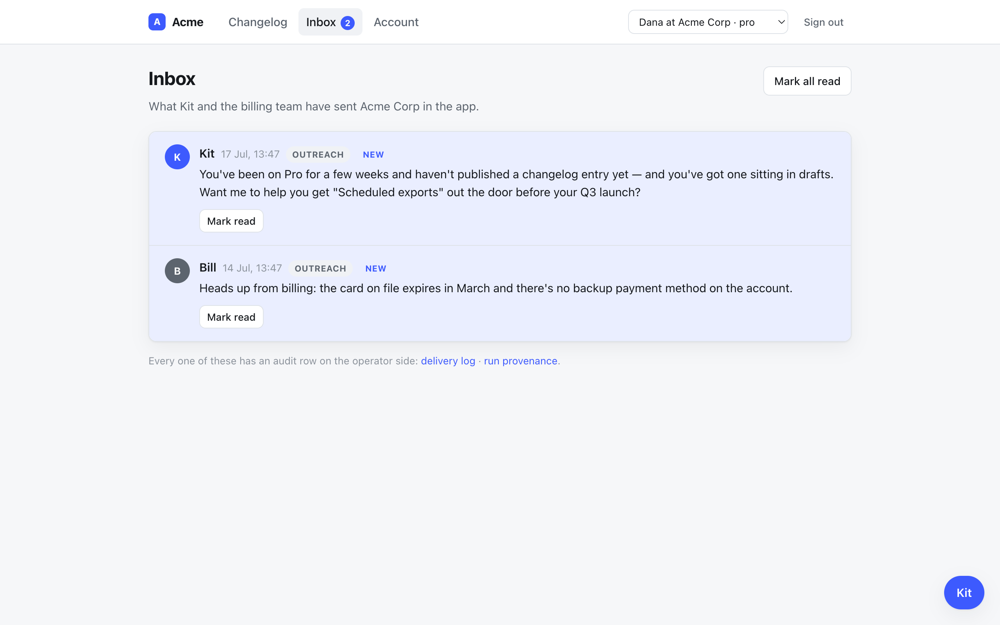
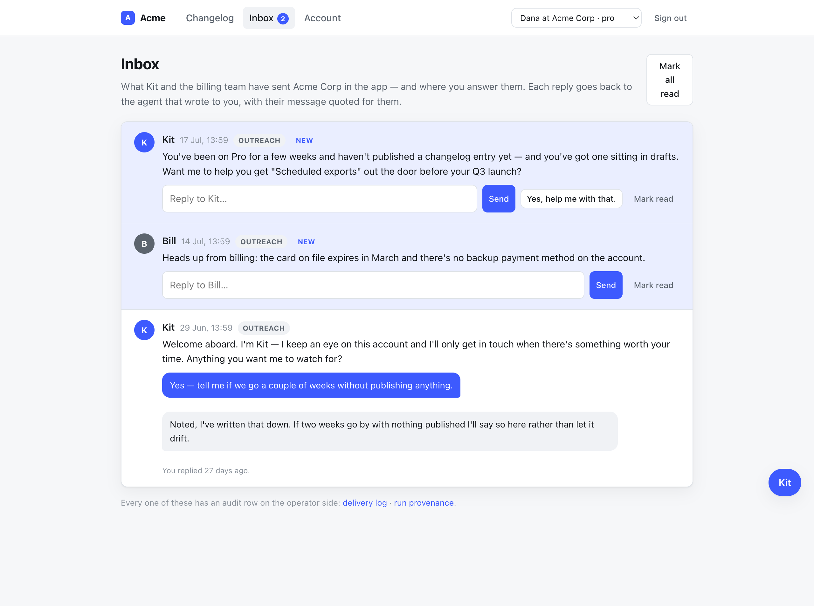
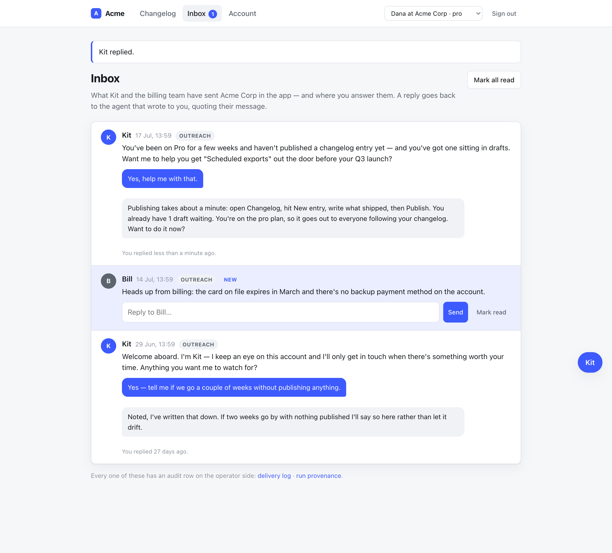
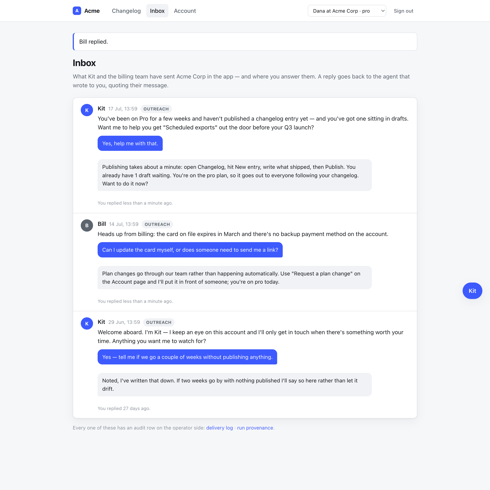
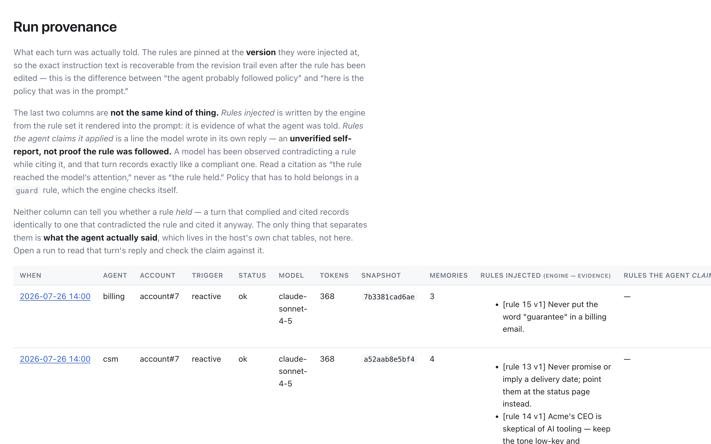
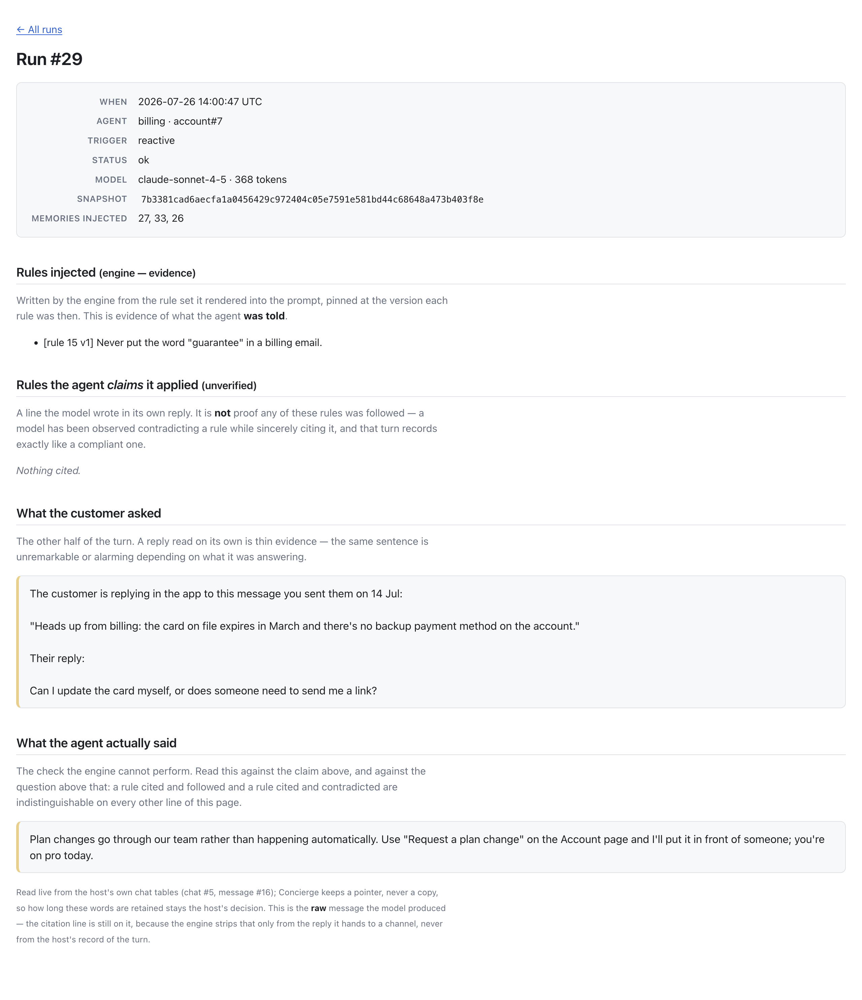

# QA — the inbox is a place a customer can answer (task 5019)

## The defect, reproduced first

Signed in as Dana at Acme against a genuinely running `test/dummy` (keyless —
`ANTHROPIC_API_KEY` unset, so the host's scripted chat answers), `/inbox`:



Two unread messages. Kit's ends *"Want me to help you get 'Scheduled exports' out
the door before your Q3 launch?"* Bill's is a statement. The only control on
either is **Mark read**. `InboxController` had `index`, `read`, `read_all` and
nothing else, and `app/views/inbox/index.html.erb` rendered no form. Confirmed
before touching anything.

## The design decision, stated

An outreach message is not in the chat thread. `Channel::InApp#perform_delivery`
hands the payload to `config.in_app_broadcaster`; the engine keeps a
`payload_digest` on `ChannelDelivery` and the words live in the host's
`inbox_messages`. So a bare "yes please" posted to the chat endpoint arrives with
no antecedent.

**This takes (a): the host quotes it.** `Inbox::Item#reply_prompt` carries the
outreach text into the turn as quoted context. The full argument, and what (a)
costs, is on the `Inbox` class; the short version:

* **(b) — persist outbound in-app outreach into the conversation** is the honest
  option and the dangerous one. Every one of Acme's inbox messages predates any
  conversation for that `(agent, account)` — the thread is opened by the *reply*.
  Persisting the outreach into it makes the first message an assistant turn, and
  the Anthropic Messages API requires the first message to be a user one. That is
  task 5015 / PR #29 exactly: a live 400 and a phase of a silently broken online
  path. It also amends the engine's standing rule that the delivery ledger is not
  a message store, which is a design change and not a host feature.
* **(c) — a delivery token the engine resolves** buys nothing over (a) here. The
  engine keeps a digest, so it would have to ask the host for the body anyway: a
  new config hook and a new endpoint parameter to arrive at the same text the
  host already holds.
* **(a)'s cost, plainly:** the transcript shows the customer quoting something
  the agent has no memory of sending, and the thread is not the single record of
  everything said either way.

One thing (a) usually gives up, this does not: the quote is composed
server-side, in `Inbox::Item#reply_prompt`, from the row the host wrote when the
engine delivered the message. The antecedent is what was actually sent, not what
a request supplied.

## What was built, and where the turn goes

`POST /inbox/:id/reply` → `Concierge::Run.reactive(scope, item.reply_prompt(text))`.

`Run.reactive(scope, message)` is the entire body of the engine's own chat
endpoint (`Concierge::ChatsController#create`) and the same call
`AgentController#review` already makes for the proactive half. No second prompt
assembly, no second RubyLLM driver, no second provenance row.

The scope asked for the browser to POST to that endpoint. It is driven from the
host instead, for the two things the endpoint cannot do — both of which the scope
also asks for:

* **The agent is not the request's to choose.** It comes off the
  `ChannelDelivery` row the message was delivered under, resolved inside this
  account's own scope. `params[:agent]` is never read, so a reply to Bill reaches
  `:billing` because of what the engine recorded. A `data-agent` attribute in the
  DOM would have made the load-bearing boundary a client-side decision.
* **Marking read and recording the exchange are the host's writes** and have to
  happen with the turn. A follow-up request can fail on its own and leave an
  answered question still flagged "new".

It also means the whole path is server-rendered and therefore fully testable —
no string concatenation in a browser that no test can reach.

## What was run

```
make verify            # rubocop 268 files, 0 offenses; 673 runs, 2607 assertions, 0 failures, 0 errors
```

Suites touched: `test/integration/host_inbox_test.rb` (+11),
`test/integration/host_isolation_test.rb` (+2), `test/scope_isolation_test.rb` (+2).

## Mutation testing — every behaviour change fails against the old code

Each mutation applied alone, full suite run, then reverted.

| # | Mutation | Red |
|---|----------|-----|
| 1 | `concierge_scope(item.agent_slug)` → `concierge_scope(:csm)` — every reply answered by Kit | **3** |
| 2 | `record_reply!` no longer sets `read_at` — replying stops implying read | **1** |
| 3 | `Run.reactive(scope, item.reply_prompt(text))` → `Run.reactive(scope, text)` — the bare reply, no antecedent | **1** |
| 4 | the `result.ok?` guard removed — a failed turn recorded as an answered exchange | **1** |
| 5 | `inbox.find(params[:id])` → an unscoped `InboxMessage.find` | **2** |
| 6 | `invites_reply?` → `true` — the affirmative offered on a message that asked nothing | **1** |
| 7 | `ChannelDelivery.for_scope(scope)` → `ChannelDelivery.where(...)` in `Inbox` | **2** |
| 8 | engine: `for_scope` drops the agent dimension (`key.except(:agent_slug)`) | **25 F + 1 E** across `scope_isolation_test`, of which **both new cases** are red on their own (`-n "/delivery is resolvable only\|reply composed from one cell/"` → 1 failure, 1 error) |

Suite green before and after every revert: `673 runs, 2607 assertions, 0 failures`.

## The load-bearing invariant

Two of these are boundary crossings, so they extend the existing suites rather
than sitting beside them.

`test/scope_isolation_test.rb` (engine, the 2×2 grid):

* **"a delivery is resolvable only from the cell that sent it"** — the reply path
  now decides *which agent is being answered* from a `ChannelDelivery` row, which
  makes `ChannelDelivery.for_scope` load-bearing in a new way. A delivery
  resolvable from a neighbouring cell would route a reply to a different persona,
  tool scope and authority envelope with nothing in the request looking wrong.
* **"a reply composed from one cell's outreach runs in that cell and no other"** —
  the turn, the conversation and the customer's words stay in the cell the
  delivery named.

`test/integration/host_isolation_test.rb` (the host surface on top of them):

* **"answering another account's inbox message is refused, and runs nothing"** —
  `/inbox/<globex id>/reply` as Dana is 404, no prompt assembled, no run in either
  account.
* **"answering the billing agent stays inside the billing cell"** — billing's
  charter in the prompt, the CSM's memory *not* in it, one run under
  `(billing, acme)` and zero under the other three cells.

## Driven by hand in a running `test/dummy`

Server: `cd test/dummy && bin/rails db:seed && bin/rails server` with
`ANTHROPIC_API_KEY` unset, so `Dummy::ScriptedChat` answers and the offline path
is what is exercised. Signed in as Dana.

**The composers, and the seeded answered exchange.** Kit's open question gets a
composer *and* the one-click affirmative; Bill's statement gets a composer only;
the 29 Jun exchange at the bottom is the seeded closed loop.



**One click on "Yes, help me with that."** — the reply is sent, Kit answers, the
exchange replaces the composer, the "new" flag is gone and the header count drops
2 → 1 without anyone pressing Mark read.



**A typed reply to Bill.** The flash says *"Bill replied."* — not Kit — and the
answer is billing's (`Request a plan change`, billing's own charter), not the
CSM's.



**The same two turns on the operator side.** Two reactive runs on `account#7`:
one `billing`, one `csm`, each carrying only its own agent's rules — billing got
`[rule 15]` (the guard), the CSM got `[rule 13]` and `[rule 14]`.



**Run #29 in full**, which is where design decision (a) is legible: "What the
customer asked" holds the quoted antecedent *and* the customer's words, and "What
the agent actually said" holds billing's reply.



## Seeds

`db/seeds.rb` gains one older Kit outreach (29 Jun) with the exchange already
closed, so the demo shows the loop and not only the affordance. The 17 Jul
"Scheduled exports" question is deliberately left open — it is the one you answer
by hand. Both halves of the seeded exchange are hand-written for the same reason
the existing hand-written transcript in that file is: a seed run must not reach a
provider, and the offline stand-in answers by keyword rather than to order.
Everything about the reply path itself is real in the running app.

## What could not be verified, and why

* **No live model.** `ANTHROPIC_API_KEY` was unset throughout, so every reply
  above came from `Dummy::ScriptedChat`, not from Anthropic. What that does *not*
  cover: whether a real model uses the quoted antecedent well. The prompt it is
  given is asserted in tests and readable on run #29; how a model reasons over it
  is not something this run establishes. (The keyword branch it hit is itself
  weak evidence the quote arrived — "Yes, help me with that." alone routes to the
  stand-in's `handoff` branch, and the quoted version routed to `publishing`.)
* **No 400-shaped proof for option (b).** The claim that persisting outreach
  assistant-first would reproduce #5015's failure rests on PR #29's write-up and
  on the seed state (inbox messages predate the conversation), not on a live
  Anthropic call made here. Nothing in this change persists outreach into a
  thread, so there is nothing to regress.
* **Real-time push is out of scope**, as specified. A reply appears on the
  redirect that follows it; an agent message that arrives while the page is open
  still needs a refresh.
* **The engine is untouched.** Nothing under `app/` or `lib/` changes. The diff
  is `test/dummy/`, the two isolation suites, and these docs — so "no engine
  change" is a property of the diff, not a claim to take on trust.
