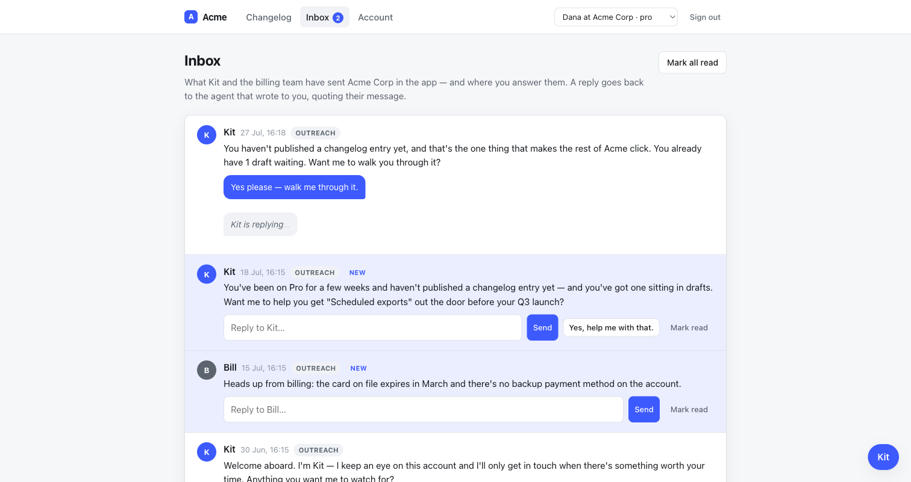
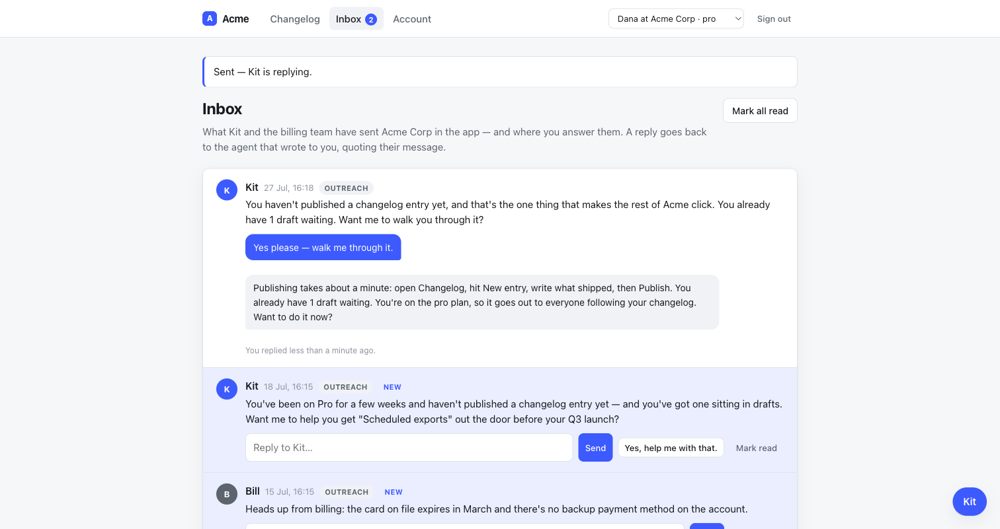
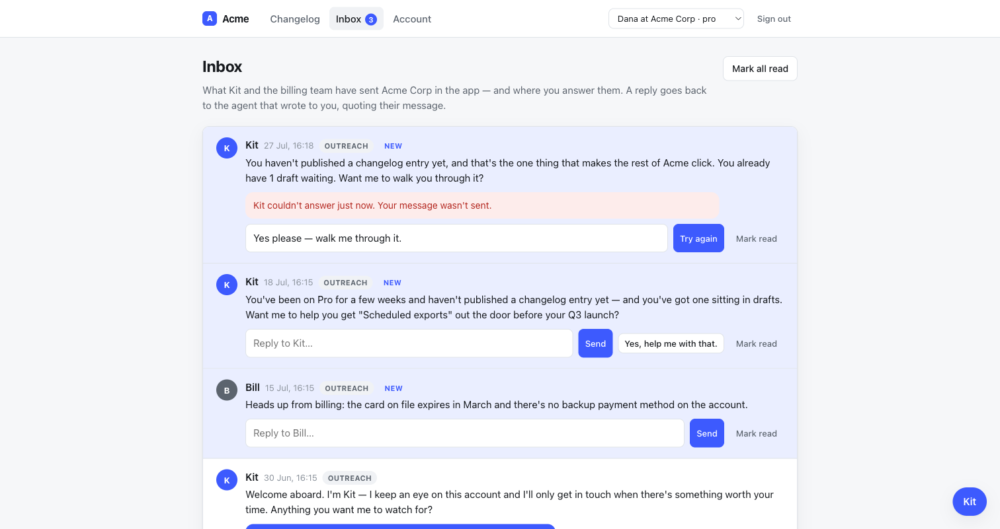

# QA — the inbox surfaces live, and the turn is not the request (task 5020)

Follow-up to task 5019 (PR #33), which made the inbox answerable and put
real-time push explicitly out of scope. Two things followed from that:

1. **An agent message that arrived while the page was open was invisible until a
   reload.** `Channel::InApp` exists because in-app delivery "must ACTIVELY
   surface (open a panel / raise a badge), not just persist a row" (design §3.5).
   The host's broadcaster only persisted. So the one channel whose entire purpose
   is active surfacing surfaced nothing.
2. **The reply blocked the request for the length of a model turn.** Offline that
   reads as instant, because `Dummy::ScriptedChat` answers in about 80ms. Against
   a real provider it is a customer watching a form post spin.

The scope note called it: the answer to (1) is the answer to (2). Run the turn in
a job, and stream the answer into the card over the same connection the agent's
unprompted messages already need.

## The engine question, answered: no default broadcaster

The scope asked whether the engine should ship one rather than leaving every host
to write it. It should not, and this PR makes the reason explicit on the class.
The engine keeps a payload *digest* — the delivery ledger is not a message store
— so it could not render this card if it wanted to. A default broadcaster would
have to invent a message store, a stream name and a partial: three host decisions
wearing one hat.

Two engine changes did land, both about the engine holding up its end of the
hook rather than doing the host's job for it.

### 1. In-app is not a channel without a broadcaster

`Channel::InApp#perform_delivery` was `config.in_app_broadcaster&.call(...)`. A
host that listed the channel and configured no hook got a silent no-op, audited
as `:delivered` — the ledger asserting a customer was reached over the one
channel that had nowhere to reach them. It now declares itself unconfigured
without the hook, and the router falls through to email.

```
test "in-app is not a channel at all without a broadcaster to surface through"
test "with no other channel either, nothing is sent and nothing is audited"
```

### 2. The audit row is written before the send, not after

This is the load-bearing one, and it is a real trade rather than a free fix.

The payload a channel is handed says *what* was said, not *who* said it: no
agent, no timestamp. Fine for email, which renders one message into a mailbox.
Not fine for in-app, which has to draw "Bill · billing · 14:02" onto a live page
— Bill and Kit are different agents with different personas and authority
(§10.1), and the customer is owed the difference. The only row that knows is the
`ChannelDelivery`, and `Outreach.dispatch` wrote it *after* `channel.deliver`
returned. So the host's broadcaster ran at the one moment its own ledger entry
did not exist yet, could not join to it, and could only persist. That ordering is
how in-app came to be persist-only in the first place.

`dispatch` now records the row, sends, and destroys the row if the send failed.

**The trade, plainly:** a crash between the write and the send leaves a row for a
message that may not have gone out, where before it lost the row for a message
that may have. For a ledger whose job is frequency caps and quiet hours,
over-counting errs toward silence and under-counting errs toward pestering
someone. This is the better way to be wrong.

```
test "the audit row for a failed send does not survive it"
test "the host's broadcaster can see the delivery row for the message it is surfacing"
```

## What the host does with it

`turbo-rails` is added to the **root Gemfile only** — not to `concierge.gemspec`.
The engine ships no Turbo code and gains no dependency.

* **Turbo Drive is off**, via `data-turbo="false"` on `<body>`. Turbo is here for
  Streams. Turning Drive on would change how every form and link in the app
  behaves (303 redirects, method-preserving follows), including the ones that
  navigate into the mounted engine admin, where a Drive visit leaves Turbo loaded
  on pages built without it. The story is "the agent's answer arrives on its
  own", and that is a Stream, not a navigation.
* **One signed stream per account**, subscribed from the layout so the badge can
  go up while the customer is on the changelog. `turbo_stream_from
  current_tenant` — from the session's tenant, never a parameter.
* **The socket refuses anonymous connections** (`ApplicationCable::Connection`).
  Turbo's signed stream name is a good gate but it only runs *after* a connection
  is accepted.
* **`InboxBroadcast` rebuilds the card through `Inbox#find`**, the one method
  that narrows to (agent, this account). A message this account may not see is a
  message it may not be pushed, and one method decides both.

### The reply, in three persisted states

The turn moved to `InboxReplyJob`, so "sent" and "answered" are two states with a
model call between them — and a third for the turn that never happened. All three
are columns, not client-side spinners, so a reload, a second tab and the phone in
the other pocket all show the same thing.

| state | columns | card |
|---|---|---|
| nothing sent | — | composer |
| in flight | `reply_body` | their words + "Kit is replying…" |
| answered | `+ replied_at` | the exchange |
| failed | `+ reply_failed_at` | error bubble, their words kept, "Try again" |

The failure state is new because a flash cannot carry it any more: the request
that started the turn was answered long before the turn failed. `fail_reply!`
also clears `read_at`, so the badge that `start_reply!` cleared comes back up —
this needs you, and now it needs you again.

The job is handed the **row**, not the words. The customer's text was written to
`reply_body` before the enqueue, and the message being answered comes off the
delivery row, so the whole prompt is assembled from records the host wrote. Which
agent answers is likewise the delivery row's to say — a job running outside a
request has no session to fall back on, which makes that narrowing more
load-bearing here, not less.

## Verified by hand, in a browser

Against a genuinely running `test/dummy` (keyless — `ANTHROPIC_API_KEY` unset, so
the host's scripted chat answers), signed in as Dana at Acme, driven through
Chrome.

**The badge goes up on a page that is not the inbox, with no reload.** On
`/changelog`, an agent review fired in the background; the DOM went from
`<span id="inbox-badge" class="badge">2</span>` to `3` with
`performance.getEntriesByType('navigation')` still reporting one navigation.

**A new message prepends itself into an open inbox.** `#inbox-messages .msg` went
from 4 to 5, the new card came in as `#inbox_message_6` under **Kit** — proving
the delivery row existed when the broadcaster ran, which is what the `dispatch`
reordering above is for.

**Sending a reply returns immediately, with the pending state on the card.**



**The answer replaces it in place — one navigation for the whole exchange.**



**A turn that fails says so on the card, keeps their words, and puts the badge
back up.**



Console: zero errors, zero warnings, across the whole session.

## One thing the browser found that the tests could not

The first end-to-end run left the card on "Kit is replying…" forever. The job had
finished — the log shows the `replace` broadcast going out 82ms after enqueue —
but the redirected page had not subscribed yet, so the push reached nobody. A
broadcast is fire-and-forget; anything sent between a page rendering and its
socket being confirmed is simply lost.

Against a real provider that window is invisible, because a model turn takes
seconds. Offline it is the *normal* case, and offline is this host's default.

So the inbox page reconciles **once**, after the socket connects, and only if
something on the page is still waiting. It is not a poll and must not become one:
at most one extra request per page load, and a turn that is genuinely still
running re-renders as still-pending and stops there — by then the stream is up
and the answer arrives the way it is supposed to.

That fix is client-side, so the suite cannot assert it; it is browser-verified
above and commented at length in `app/views/inbox/index.html.erb`.

## Tests

`make verify` — rubocop clean, 727 runs, 0 failures.

New:

* `test/integration/host_inbox_live_test.rb` — what goes down the stream on
  arrival, on reply, on failure, on read; that a message for one account is never
  pushed to another; that a page subscribes only to its own account's signed
  stream name.
* `test/integration/host_cable_connection_test.rb` — the socket accepts a
  signed-in customer, refuses an anonymous one, refuses a session naming a user
  who no longer exists.
* In `host_inbox_test.rb` — the reply comes back before the turn does; a message
  already being answered is not answered twice; a failed turn leaves it
  unanswered, unread and says so on the card; a failed reply can be sent again; a
  queue that will not take the work says so rather than leaving a card spinning.

Changed: every test that drove the reply now drives it through
`Concierge::Test::HostApp#reply_to`, which posts *and* runs the job, because a
test that only posts is now asserting against a card that says "Kit is
replying…".

## Not done

* **A real model.** No `ANTHROPIC_API_KEY` in this environment, so every reply in
  these screenshots came from `Dummy::ScriptedChat`. The offline turn is faster
  than a page load, which is what surfaced the subscribe gap above — so the one
  case these screenshots do *not* exercise is the one the async change exists
  for.
* **Redis.** `cable.yml` is `async` in development and `test` in test, so every
  broadcast here stayed inside one process. A multi-process host needs the
  production adapter; nothing in this change assumes otherwise, but nothing here
  proves it either.
* **Turbo Drive.** Deliberately off, so none of the app's redirects were audited
  for 303-vs-302 correctness. Turning Drive on later is its own piece of work.
