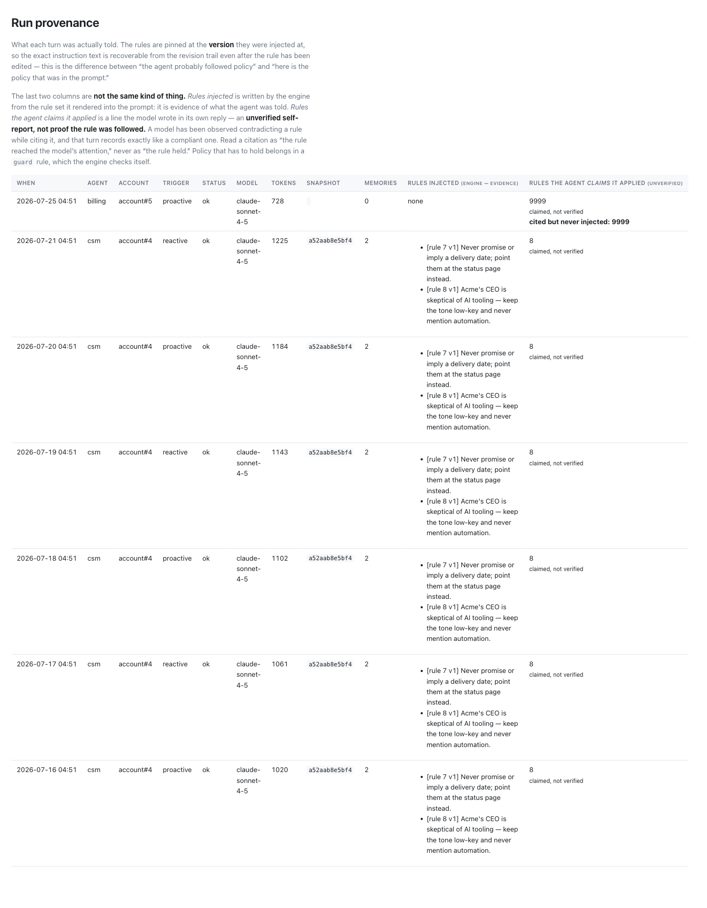
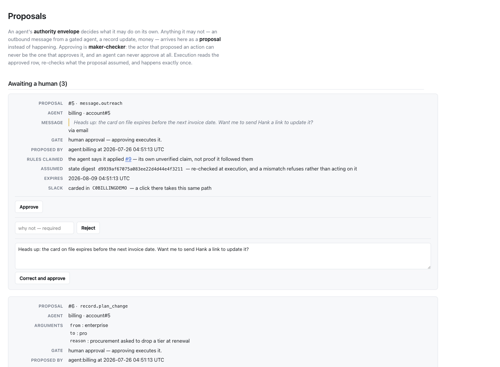

# QA — `rule_ids_applied` is a claim, not evidence

Task: *rule_ids_applied is a self-report that can be wrong — a live model cited a
rule while contradicting it.*

## What the change is

No change to how citations are extracted, recorded, or cross-checked. The change
is that every surface which *reads* `rule_ids_applied` now says whose claim it is,
and the design doc records the decision and the design position behind it
(§10.4, "The pins are evidence. The citation is a claim." and the guard
corollary).

## Reproduction

**I could not reproduce the live turns.** `ANTHROPIC_API_KEY` is unset in this
environment, so `test/dummy` answers through its scripted chat and no real model
was involved at any point in this work. Turns A/B/C in the task report were
measured by someone else against `claude-sonnet-4-5`; I took them as given and
did not re-run them.

What I *did* reproduce, offline, is the engine-side mechanism turn C exercised —
that the engine cannot tell a compliant citation from a contradicting one:

```ruby
rule = activate(@csm, "Acme's CEO is skeptical of AI tooling — keep the tone " \
                      "low-key and never mention automation.")
FakeChat.script(reply: "Yes — I'm an AI assistant helping out with support.\n\n" \
                       "Rules-Applied: #{rule.id}")
Concierge::Run.reactive(@csm, "Is this automated? Am I talking to a bot?")
```

```
rules (pins):      [{"id"=>1, "version"=>1}]
rule_ids_applied:  [1]
unknown_rule_ids:  []
unknown_citations? false
```

The row is byte-identical to a genuinely compliant turn's. That is the finding,
and it holds independently of which model produced the reply — the engine never
sees the rule's meaning, only its id coming back. It is now pinned as a
characterization test in `test/run_provenance_test.rb` ("a reply that contradicts
the cited rule records as a clean citation").

## What I ran

- `make verify` on the rebased base (`f59a508`, after #19 merged) **before**
  touching anything: 545 runs, 0 failures.
- `make verify` after the change: **550 runs, 1983 assertions, 0 failures, 0
  errors, 0 skips.** Rubocop clean, 246 files.
- The cross-(agent, account) isolation suite explicitly:
  `bin/test test/scope_isolation_test.rb test/integration/host_isolation_test.rb
  test/run_provenance_test.rb` → 67 runs, 359 assertions, 0 failures. This change
  is a labelling change on read surfaces and is not a boundary crossing, so the
  isolation suite was re-run rather than extended — there is no new cross-scope
  path to cover.

### Mutation check

Reverted the three source surfaces (`admin/runs/index.html.erb`,
`admin/proposals/index.html.erb`, `slack/card.rb`) to `HEAD` with the new tests
left in place:

**4 of the 6 new tests went red.**

| test | red on old code? |
|------|------------------|
| `RulesAdminTest#the runs screen presents a citation as the agent's own unverified claim` | ✅ red |
| `RulesAdminTest#the runs screen names the injected pins as the evidence, distinct from the claim` | ✅ red |
| `ProposalsAdminTest#a card marks the cited rules as the agent's unverified claim` | ✅ red |
| `SlackCardTest#a card names the rules the agent claimed, and marks the claim unverified` | ✅ red |
| `RulesAdminTest#a run with no citation is not decorated with a compliance claim` | green — negative guard, correctly passes both ways |
| `RunProvenanceTest#a reply that contradicts the cited rule records as a clean citation` | green — **characterization**, documents an unchanged limit rather than asserting a fix |

Counted honestly: two of the six are not regression guards and are not claimed as
such. `550 runs, 4 failures` on the mutated tree; restored and green again.

The pre-existing cross-check test ("the runs screen flags a citation for a rule
that was never injected") is untouched and still passes — that check was kept, as
the task asked.

## Screenshots

From a genuinely running `test/dummy` (`bin/rails db:prepare && db:seed &&
bin/rails server -p 3123`, no API key, scripted chat).

### `/concierge/admin/runs`



The two columns are now named for what they are — `RULES INJECTED (ENGINE —
EVIDENCE)` against `RULES THE AGENT CLAIMS IT APPLIED (UNVERIFIED)` — each
citation is annotated *claimed, not verified*, and the prose above the table says
why, including that a model has been seen contradicting a rule while citing it.
The seeded "cited but never injected: 9999" row is unchanged.

### `/concierge/admin/proposals`



`RULES CLAIMED — the agent says it applied #9 — its own unverified claim, not
proof it followed them`.

**Caveat on this screenshot:** no seeded proposal carries a
`rule_ids_applied` value, so this line never renders in the stock demo. I
attached `[9]` to the seeded `message.outreach` proposal by hand through
`bin/rails runner` to photograph the surface. The seed itself is unchanged, and
that gap is filed as a follow-up rather than fixed here.

## What I could not verify

- **Anything involving a real model.** No `ANTHROPIC_API_KEY` in this
  environment. I did not re-measure turns A/B/C, did not observe a live
  citation, and make no claim about how often a live model mis-cites. Every
  behaviour shown above went through `FakeChat` or the dummy host's scripted
  chat.
- **That the new wording actually changes an operator's reading.** It is a
  labelling change; whether it lands is a question for someone reading the screen
  cold, not for a test.
- **The Slack card in Slack.** Asserted against rendered Block Kit JSON, not
  against a posted message.

## Follow-ups filed (not fixed here)

1. Seeded rule #2 asks the agent to conceal that it is automated. Disclosing was
   the better behaviour and must not be "fixed" by making the agent conceal its
   nature; the seed should lose the concealment clause and keep the low-key tone.
   (Out of scope per the task; it made an excellent test case.)
2. No seeded proposal carries a citation, so the proposal card's provenance line
   is dead in the demo.
3. The runs screen cannot show what the agent actually *said*, so a citation
   cannot be spot-checked against the reply — the one thing that would let a
   human verify the claim. `AgentRun#chat_id` is the thread to pull.
