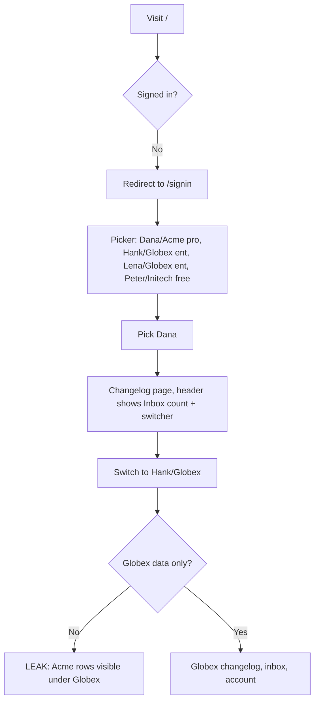
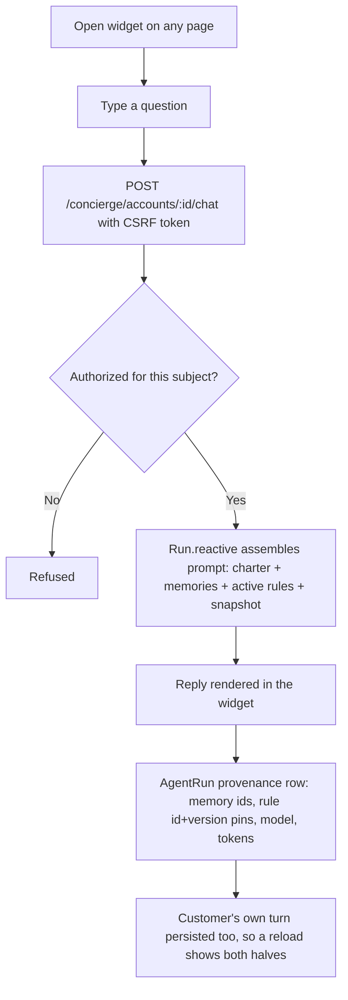
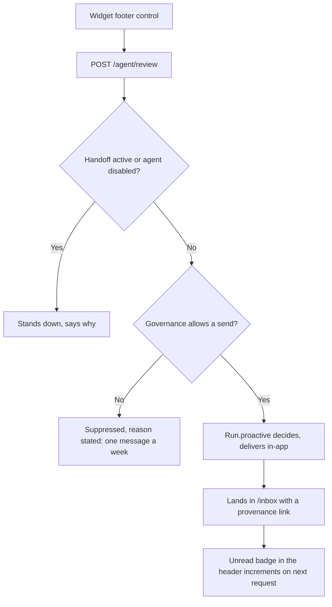

# Dogfood Report — dogfood/demo-host

> Diff-scoped browser QA of the demo host surface (PR #13's journeys) vs the trunk. Generated by `/ce-dogfood` on 2026-07-26.

**Scope deviation, stated up front.** The chosen target was PR #13 (the demo host app). Its head
(`task/5002-demo-host-app-a-real-acme-product-surfac`) is stale: **12 commits touched that surface
after it merged** — including the chat authorization fix (#26), operator identity (#26), online
message persistence (#29) and the repliable inbox (#33). Checking out its head would have meant
re-discovering bugs already fixed today and reporting them as findings. So PR #13's *journeys* are
tested against **current `main`**, on branch `dogfood/demo-host`, so any fixes land on a branch
rather than the trunk.

## Diff Summary

- **A customer-facing product appeared where there was none.** Before PR #13, `test/dummy` had a
  Tenant, a User and zero controllers or views — every screen in the project was engine admin.
- **Host surfaces added:** sign-in picker + account switcher (`sessions`), changelog CRUD with
  publish/unpublish (`changelog_entries`), an inbox of agent outreach (`inbox`), an account page
  with a gated plan-change request (`account`, `plan_changes`), "talk to a human"
  (`handoffs`), and an on-demand proactive trigger (`agent#review`).
- **The chat widget** (`shared/_chat_widget.html.erb`) — host-owned markup posting to the engine's
  `POST /concierge/accounts/:subject_id/chat`. Closes a gap two earlier PRs recorded: the endpoint
  could not be exercised without a host page supplying a CSRF token.
- **Since then, on the same surface:** replies from the inbox with a server-composed quoted
  antecedent and agent taken off the delivery row (#33); the customer's own chat turn now persists
  (#29); ActiveStorage installed so a real model works at all (#14); authorization hooks for chat
  and operator endpoints (#15, #21, #26).

## Personas

Source: **inferred** — no `STRATEGY.md`, `VISION.md` or persona doc exists in the repo.

- **Dana — the customer.** Champion at Acme Corp, `pro` plan, mid-onboarding with one unpublished
  draft and a Q3 launch coming. Wants to ship her changelog, get straight answers about her own
  account, not be pestered, and reach a human when the agent can't help.
- **The operator — Acme's CSM / billing staff.** Works `/concierge/admin/*`. Wants to see what the
  agent did and why, approve or refuse safely, and prove after the fact what was in force.
- **The host developer.** Mounting the engine in a real app. Wants clear seams, no surprise
  requirements on their auth/queue/asset pipeline, and to not reimplement what the engine should own.

## Flows Tested

### A. Sign in and switch accounts



### B. Write and publish a changelog entry

```mermaid
flowchart TD
    A[/changelog] --> B[New entry]
    B --> C{Valid?}
    C -->|No| D[Inline validation error]
    C -->|Yes| E[Draft created]
    E --> F[Publish]
    F --> G[Entry shows as published, empty-state copy gone]
    G --> H[Snapshot the agent reads now reports published_changelogs: 1]
```

### C. Ask Kit a question (reactive)



### D. "Kit, take a look" — proactive run on demand



### E. Inbox: read and reply

```mermaid
flowchart TD
    A[/inbox] --> B[Outreach from Kit and Bill, unread badges]
    B --> C{Message invites a reply?}
    C -->|Yes| D[Composer shown]
    D --> E[POST /inbox/:id/reply]
    E --> F[Agent taken off the ChannelDelivery row, NOT the request]
    F --> G[Run.reactive with server-composed quoted antecedent]
    G --> H[Agent reply rendered under the message]
    H --> I[Message marked read by the same write]
    C -->|No| J[Mark read only]
```

### F. Gated plan change — the authority round trip

```mermaid
flowchart TD
    A[/account] --> B[Request plan change to enterprise]
    B --> C[AgentProposal staged under :billing]
    C --> D[UI: your request is with our team]
    D --> E{Plan changed?}
    E -->|Yes| F[BUG: engine executed a gated action]
    E -->|No| G[Correct: still pro]
    G --> H[Operator opens /concierge/admin/proposals]
    H --> I[Approve]
    I --> J[Precondition re-validated, host executor runs]
    J --> K[Back on /account: plan is enterprise, attributed to approver]
```

### G. Talk to a human — handoff

```mermaid
flowchart TD
    A[/account] --> B[Talk to a human]
    B --> C[Concierge::Handoff opened on the CSM thread]
    C --> D[UI says Kit has stepped back, composer replaced]
    D --> E[Kit, take a look now refuses]
    E --> F[Hand it back]
    F --> G[Normal service resumes, handoff released with who released it]
```

## Test Matrix & Results

| # | Flow | Journey / Scenario | Status | Issue | Fix | Commit |
|---|------|--------------------|--------|-------|-----|--------|
| 1 | A | Sign in as Dana, land on the product | Pending | | | |
| 2 | A | Switch account, confirm scoping | Pending | | | |
| 3 | B | Write and publish a changelog entry | Pending | | | |
| 4 | C | Ask Kit a question in the widget | Pending | | | |
| 5 | D | "Kit, take a look" + governance suppression on the second click | Pending | | | |
| 6 | E | Reply to Kit's outreach from the inbox | Pending | | | |
| 7 | E | Reply to Bill routes to the `:billing` agent | Pending | | | |
| 8 | F | Request a plan change (plan must NOT change) | Pending | | | |
| 9 | F | Approve in admin, plan actually changes | Pending | | | |
| 10 | G | Handoff stands the agent down, then hand back | Pending | | | |
| 11 | — | Cross-account isolation, adversarial from the browser | Pending | | | |
| 12 | — | Empty and error states (Initech; blank submits) | Pending | | | |
| 13 | — | Responsive + keyboard accessibility spot check | Pending | | | |

Status values: `Pending`, `Pass`, `Fixed`, `Skipped`, `Blocked (needs human verify)`, `Blocked (human decision)`.

## What Was Fixed

_Run in progress._

## Paper Cuts (by persona)

_Run in progress._

## Console Errors

_Run in progress._

## Human Verifications

- **Live model replies.** The dev server for this run is started without `ANTHROPIC_API_KEY`
  (the key cannot be passed from this session), so replies come from `Dummy::ScriptedChat`.
  Prompt assembly, routing, persistence and provenance are all still observable; the *quality* of
  a real model's answer is not. Any scenario whose verdict depends on a real model is marked
  `Blocked (needs human verify)`.

## Decisions for a Human

_Run in progress._

## Learnings

_Run in progress._

## Final Status

_Run in progress._
