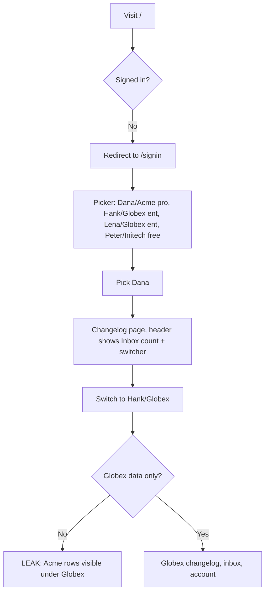
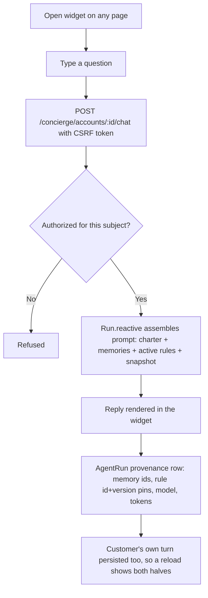
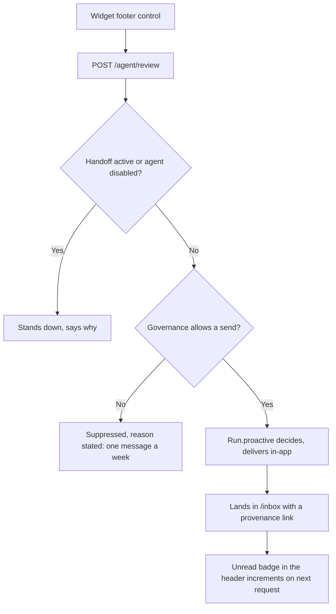

# Dogfood Report — dogfood/demo-host

> Diff-scoped browser QA of the demo host surface (PR #13's journeys) vs the trunk. Generated by `/ce-dogfood` on 2026-07-26.

**Scope deviation, stated up front.** The chosen target was PR #13 (the demo host app). Its head
(`task/5002-demo-host-app-a-real-acme-product-surfac`) is stale: **12 commits touched that surface
after it merged** — including the chat authorization fix (#26), operator identity (#26), online
message persistence (#29) and the repliable inbox (#33). Checking out its head would have meant
re-discovering bugs already fixed today and reporting them as findings. So PR #13's *journeys* are
tested against **current `main`**, on branch `dogfood/demo-host`, so any fixes land on a branch
rather than the trunk.

## Diff Summary

- **A customer-facing product appeared where there was none.** Before PR #13, `test/dummy` had a
  Tenant, a User and zero controllers or views — every screen in the project was engine admin.
- **Host surfaces added:** sign-in picker + account switcher (`sessions`), changelog CRUD with
  publish/unpublish (`changelog_entries`), an inbox of agent outreach (`inbox`), an account page
  with a gated plan-change request (`account`, `plan_changes`), "talk to a human"
  (`handoffs`), and an on-demand proactive trigger (`agent#review`).
- **The chat widget** (`shared/_chat_widget.html.erb`) — host-owned markup posting to the engine's
  `POST /concierge/accounts/:subject_id/chat`. Closes a gap two earlier PRs recorded: the endpoint
  could not be exercised without a host page supplying a CSRF token.
- **Since then, on the same surface:** replies from the inbox with a server-composed quoted
  antecedent and agent taken off the delivery row (#33); the customer's own chat turn now persists
  (#29); ActiveStorage installed so a real model works at all (#14); authorization hooks for chat
  and operator endpoints (#15, #21, #26).

## Personas

Source: **inferred** — no `STRATEGY.md`, `VISION.md` or persona doc exists in the repo.

- **Dana — the customer.** Champion at Acme Corp, `pro` plan, mid-onboarding with one unpublished
  draft and a Q3 launch coming. Wants to ship her changelog, get straight answers about her own
  account, not be pestered, and reach a human when the agent can't help.
- **The operator — Acme's CSM / billing staff.** Works `/concierge/admin/*`. Wants to see what the
  agent did and why, approve or refuse safely, and prove after the fact what was in force.
- **The host developer.** Mounting the engine in a real app. Wants clear seams, no surprise
  requirements on their auth/queue/asset pipeline, and to not reimplement what the engine should own.

## Flows Tested

### A. Sign in and switch accounts



### B. Write and publish a changelog entry

```mermaid
flowchart TD
    A[/changelog] --> B[New entry]
    B --> C{Valid?}
    C -->|No| D[Inline validation error]
    C -->|Yes| E[Draft created]
    E --> F[Publish]
    F --> G[Entry shows as published, empty-state copy gone]
    G --> H[Snapshot the agent reads now reports published_changelogs: 1]
```

### C. Ask Kit a question (reactive)



### D. "Kit, take a look" — proactive run on demand



### E. Inbox: read and reply

```mermaid
flowchart TD
    A[/inbox] --> B[Outreach from Kit and Bill, unread badges]
    B --> C{Message invites a reply?}
    C -->|Yes| D[Composer shown]
    D --> E[POST /inbox/:id/reply]
    E --> F[Agent taken off the ChannelDelivery row, NOT the request]
    F --> G[Run.reactive with server-composed quoted antecedent]
    G --> H[Agent reply rendered under the message]
    H --> I[Message marked read by the same write]
    C -->|No| J[Mark read only]
```

### F. Gated plan change — the authority round trip

```mermaid
flowchart TD
    A[/account] --> B[Request plan change to enterprise]
    B --> C[AgentProposal staged under :billing]
    C --> D[UI: your request is with our team]
    D --> E{Plan changed?}
    E -->|Yes| F[BUG: engine executed a gated action]
    E -->|No| G[Correct: still pro]
    G --> H[Operator opens /concierge/admin/proposals]
    H --> I[Approve]
    I --> J[Precondition re-validated, host executor runs]
    J --> K[Back on /account: plan is enterprise, attributed to approver]
```

### G. Talk to a human — handoff

```mermaid
flowchart TD
    A[/account] --> B[Talk to a human]
    B --> C[Concierge::Handoff opened on the CSM thread]
    C --> D[UI says Kit has stepped back, composer replaced]
    D --> E[Kit, take a look now refuses]
    E --> F[Hand it back]
    F --> G[Normal service resumes, handoff released with who released it]
```

## Test Matrix & Results

| # | Flow | Journey / Scenario | Status | Issue | Fix | Commit |
|---|------|--------------------|--------|-------|-----|--------|
| 1 | A | Sign in as Dana, land on the product | Pass | - | - | - |
| 2 | A | Switch account, confirm scoping | Pass | - | - | - |
| 3 | B | Write and publish a changelog entry | Pass | - | - | - |
| 4 | C | Ask Kit a question in the widget | Pass | - | - | - |
| 5 | D | "Kit, take a look" + governance suppression on the second click | Pass | - | - | - |
| 6 | E | Reply to Kit's outreach from the inbox | Pass | - | - | - |
| 7 | E | Reply to Bill routes to the `:billing` agent | Pass | - | - | - |
| 8 | F | Request a plan change (plan must NOT change) | Pass | - | - | - |
| 9 | F | Approve in admin, plan actually changes | Pass | - | - | - |
| 10 | G | Handoff stands the agent down, then hand back | Pass | - | - | - |
| 11 | — | Cross-account isolation, adversarial from the browser | Pass | - | - | - |
| 12 | — | Empty and error states (Initech; blank submits) | Fixed | Blank chat submit answered 200 and spent a model call | Refuse a blank message at the endpoint | `d801635` |
| 13 | — | Responsive + keyboard accessibility spot check | Fixed | Admin queue tables pushed the whole page sideways at 380px | Table scrolls itself at narrow widths | `1bd3867` |
| 0 | — | `bin/rails db:seed` on a used database (blocker, found in Phase 3) | Fixed | FK cycle between `messages` and `tool_calls` broke the documented reset | Null the link, truncate child-first | `9dfc07d` |

Status values: `Pending`, `Pass`, `Fixed`, `Skipped`, `Blocked (needs human verify)`, `Blocked (human decision)`.

## What Was Fixed

### `bin/rails db:seed` could not reset a database that had been used — `9dfc07d`
- **Symptom:** the documented reset path died with `ActiveRecord::InvalidForeignKey: FOREIGN KEY constraint failed` at `seeds.rb:20`. Hit immediately in Phase 3, before any scenario could run.
- **Root cause:** ruby_llm's tool-call tables reference each other in a cycle — `tool_calls.message_id -> messages` (the assistant turn that asked) and `messages.tool_call_id -> tool_calls` (the tool-result turn that answers). `delete_all` does not cascade and no ordering satisfies a cycle. `ToolCall` was also absent from the truncation list entirely. Both tables only have rows once a **real** model has called a tool, so every keyless run left them empty and the break was invisible until someone used a live key.
- **Fix:** `test/dummy/db/seeds.rb` nulls `messages.tool_call_id` first, then truncates child-before-parent with `ToolCall` in the list.
- **Regression test:** `test/dummy_seeds_test.rb` seeds, plants the tool_call/tool-result pair a live turn writes, and seeds again. The pre-existing seeds test could not have caught this — it runs against a fresh throwaway database, so it only ever exercised a *first* seed. Verified against two mutations (drop the cycle break; drop `ToolCall`), each of which fails it. An earlier version of the test created only the tool_call and not the message pointing back, and passed against the cycle mutation — a fixture modelling half the shape tests half the bug.

### A blank chat submit spent a model call — `d801635`
- **Symptom:** posting an empty message answered `200`. It produced run #58 against Initech with `prompt=nil` and a real reply.
- **Root cause:** `Concierge::ChatsController#create` passed `params[:message].to_s` straight to `Run.reactive` with no emptiness check, so the engine assembled a prompt, called the model, and wrote an `AgentRun` whose own question reads back as "not persisted" — an audit row for a question nobody asked.
- **Fix:** `app/controllers/concierge/chats_controller.rb` refuses a message that is blank once stripped, using the same JSON refusal shape as every other denial there. Whitespace around real words is still a message. Notably the host's own inbox reply already guarded this ("Nothing to send.") — the newer surface got it right, the older engine endpoint never did.
- **Regression test:** `test/integration/chat_widget_test.rb` asserts all three blank shapes refuse **and** start no run, so a future version that returns 422 after burning the call still fails. Plus a companion test that padded real text still works. Verified by removing the guard.

### Wide admin tables scrolled the whole page — `1bd3867`
- **Symptom:** at 380x720, `/concierge/admin/proposals` measured 816px of content in a 380px viewport; the heading and prose scrolled off sideways with the table. `/runs` and `/memories` too.
- **Root cause:** the admin stylesheet (added in PR #7, deliberately element-selector-only) styles tables `width: 100%` with no provision for seven columns at phone width, and the views carry no wrapper element to make a scroll container.
- **Fix:** inside the existing `max-width: 40rem` query only, the table becomes its own scroll container. Desktop still computes `display: table`.
- **Regression test:** none — this is a computed-layout property with no behavioural assertion to make. Checked by measuring `scrollWidth` vs `innerWidth` on all three screens at 380px (now equal) and confirming desktop `display: table` at 1280px.

## Paper Cuts (by persona)

- **Dana (customer)** — the seeded 17 Jul outreach ("you haven't published a changelog entry yet") stays in the inbox unchanged after she publishes, so the inbox contradicts the product she is looking at. Historical messages arguably *should* be immutable, but nothing marks it as answered or stale. **Low** — deferred; it is a demo-data and product-design question, not a defect.
- **Dana (customer)** — a customer can hand back a thread a staff member seized (`released_by=dana@acme.test`). Reasonable, since she opened it, but it is worth a deliberate decision rather than a side effect. **Low** — deferred, noted for the operator flow.
- **Operator** — the proposals queue explains its own semantics in three long prose paragraphs above the table. Excellent on first read, in the way for the hundredth. **Low** — deferred.
- **Host developer** — nothing. The seams behaved exactly as documented at every point I poked them.

## Console Errors

None. `agent-browser errors` was clean after sign-in, after a chat turn, and after the proactive run.

## Human Verifications

- **Live model reply quality — pending.** The server ran without `ANTHROPIC_API_KEY`, so every reply came from `Dummy::ScriptedChat`. No scenario needed to be *blocked* on this: each was judged on the mechanism (prompt contents, agent routing, provenance rows, governance decisions), all of which are observable offline. What a human should still confirm with a key: that Kit's answers read well, and that a reply to an inbox message visibly uses the quoted antecedent.
- **Email delivery, Slack interactivity, payments — not applicable.** None are on the journeys tested; the demo's outreach is in-app.

## Decisions for a Human

None. All three defects were small, contained and unambiguous, so each was fixed under the Phase 5 autonomous rule. The two paper cuts that involve a product judgement (stale outreach, who may release a handoff) are recorded above as deferred rather than escalated, because neither blocks the branch.

## Learnings

- **The blind spot is structural, and this run hit it again.** Three of today's bugs (#14 ActiveStorage, #5014 provider degrade, #5015 one-sided conversations) came from the online path never being exercised. The seed blocker is a fourth instance of the *same* shape: `tool_calls` rows exist only after a real model calls a tool, so a keyless CI can never populate them. Worth feeding to `ce-compound`: **when a code path can only be reached with a live provider, assume it is broken until something has actually reached it.**
- **A fixture that models half a shape tests half a bug.** My first regression test for the seed created the `tool_call` but not the tool-result message pointing back, so it caught the missing-`ToolCall` ordering and passed straight through the FK *cycle*. Only mutating both halves exposed it.
- **`agent-browser click` does not scroll.** It reports `✓ Done` on an element outside the viewport while the click lands nowhere — no request, no error. This cost three false "the app is broken" conclusions on the approve and hand-back steps. `elementFromPoint` returning `null` at the element's own coordinates is the tell. Always `scrollintoview` first, and confirm state changed rather than trusting `✓ Done`.
- **Silencing tool stderr hides the diagnosis.** I piped `agent-browser` to `/dev/null` for brevity and lost a `CDP error (DOM.getBoxModel)` that named the problem directly.
- **The newer surface guarded what the older one didn't.** The inbox reply refuses a blank message; the engine's chat endpoint, written earlier, did not. Newer code carrying the better invariant is a signal about where else to look.

## Final Status

**Ready.** All 13 scenarios pass (3 after fixes), no scenario is blocked on a human decision, and the automated suite is green on this branch: **676 runs, 2622 assertions, 0 failures, 0 errors, 0 skips** (`make verify`, rubocop included). Up from 288 runs at the start of the day.

The authority model held everywhere it was pushed: a gated plan change stayed `pro` until a human approved it and then really became `enterprise`; a reply to Bill reached `:billing` off the delivery row; and every cross-account attempt from a live session was refused (403/403/404).

**Caveats, in order of importance:**

1. **No live model.** The run used `Dummy::ScriptedChat`, so no reply's *quality* was judged. Prompt assembly, agent routing, persistence, provenance and governance are all verified independently of the model. The scripted replies did track real state — "You've published 1 entry already" immediately after publishing — so the snapshot path is genuinely exercised.
2. **The three fixes are on `dogfood/demo-host`, not `main`.** They need a PR.
3. **Two paper cuts deferred** (stale outreach copy, who may release a handoff) — both product questions.
